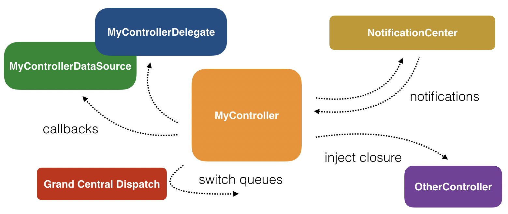
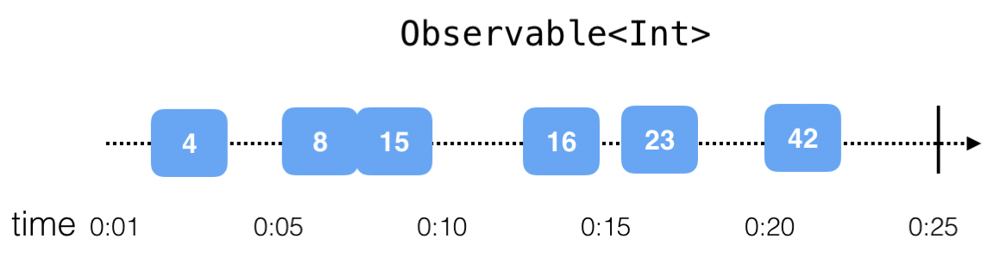
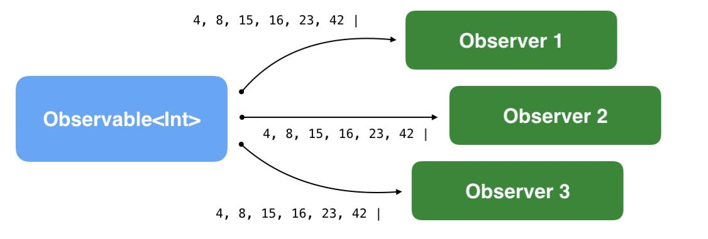
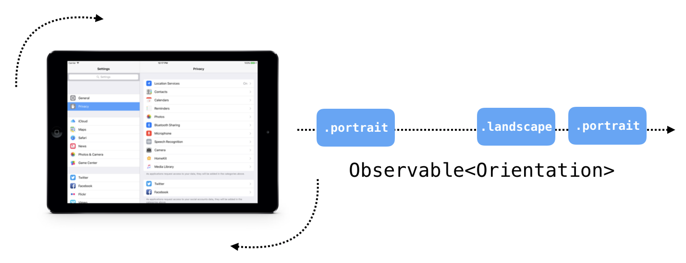
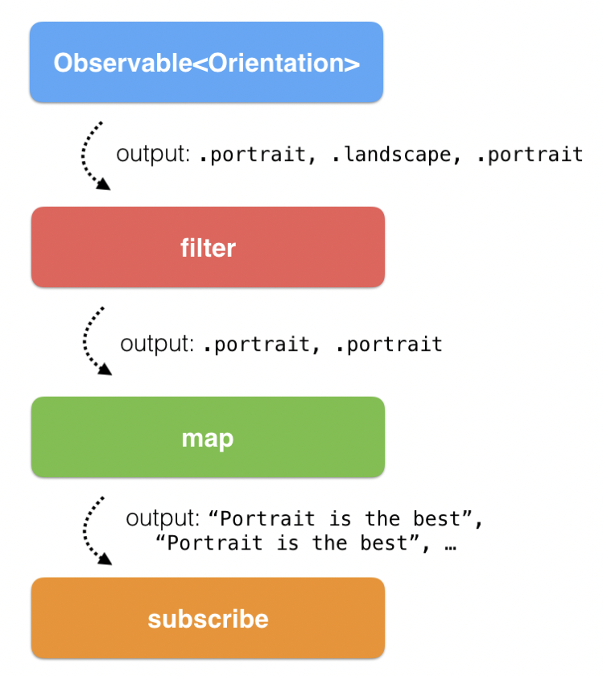
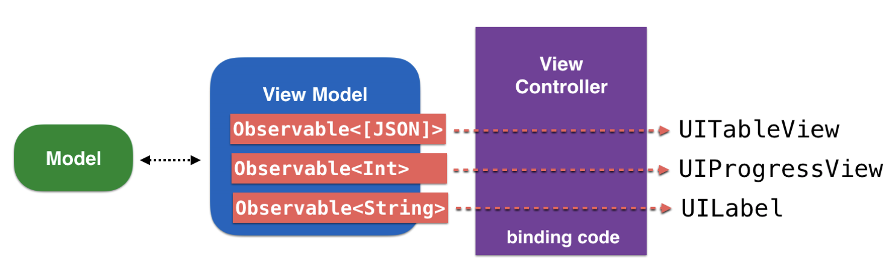
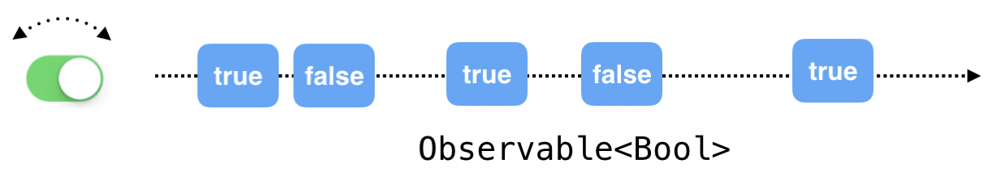

*Written by: __Nguyen Minh Tam__*

#  Section 1: Getting started with RxSwift

Mục tiêu:

- Những problem của asynchronous programming mà RxSwift nhắm đến.
- Solution.
- Các class cơ bản trong foundation của Rx framework.

##  Chapter 1: Hello RxSwift

RxSwift là gì?

> RxSwift is a library for composing asynchronous and event-based code by using observable sequences and functional style operators, allowing for parameterised execution via schedulers.

Nói theo cách dễ hiểu hơn:

> RxSwift, in its essence, simplifies developing asynchronous programs by allowing your code to react to new data and process it in a sequential, isolated manner.
> 
> Hiểu nôm na là: RxSwift giúp đơn giản hoá quá trình phát triển ứng dụng bất đồng bộ bằng cách cho phép code của bạn tương tác với data và xử lý chúng theo một cách tuần tự và độc lập.

__Menu__

- [Introduction to asynchronous programming](#introduction-to-asynchronous-programming)
	- [Cocoa and UIKit Asynchronous APIs](#cocoa-and-uikit-asynchronous-apis)
		- [Synchronous code](#synchronous-code)
		- [Asynchronous code](#asynchronous-code)
	- [Asynchronous programming glossary](#asynchronous-programming-glossary)
- [Foundation of RxSwift](#foundation-of-rxswift)
	- [Observables](#observables)
	- [Operators](#operators)
	- [Schedulers](#schedulers)
- [App architecture](#app-architecture)
- [RxCocoa](#rxcocoa)
- [Installing RxSwift](#installing-rxswift)
- [Community](#community)
- [Where to go from here](#where-to-go-from-here)

### Introduction to asynchronous programming

Trong app iOS, tại bất cứ thời điểm nào đều xử lý những tác vụ sau:

- Phản hồi với tap vào button
- Ẩn keyboark khi text field mất focus
- Download ảnh lớn từ internet
- Lưu data vào disk
- Play audio

Tất cả những tác vụ này đều có thể cùng diễn ra một lúc. Ví dụ như khi ẩn keyboard, audio đang phát không hề bị dừng cho đến khi animation kết thúc đúng hem? Và những tác vụ khác nhau trên không block lẫn nhau. Bởi vì iOS cung cấp nhiều API có thể thực hiện các tác vụ trên nhiều thread riêng biệt và trên nhiều core khác nhau của CPU.

Rất phức tạp để có thể viết code chạy song song, đặc biệt là những tác vụ cần làm việc trên cùng một data. Rất khó để tranh luận rằng đoạn code nào sẽ update data trước và đoạn nào đọc kết quả sau cùng.

#### Cocoa and UIKit Asynchronous APIs

Apple giúp chúng ta viết asynchronous code bằng các API sau:

- NotificationCenter
- The delegate pattern
- Grand Central Dispatch
- Closures

Bởi vì hầu hết các class và UI component đều hoạt động bất đồng bộ, nên không thể nào quyết định được code của toàn bộ app được chạy như thế nào. Nói tóm lại là, code của app được thực thi khá là lạ lùng, nó phụ thuộc vào rất nhiều nhân tố bên ngoài, ví dụ như user input, network activity, hoặc là event của OS. Mỗi lần user chạy app là một lần code chạy khác vì chính những nhân tố bên ngoài đó.

Dù sao đi nữa thì những API liệt kê ở trên đều vô cùng xuất sắc, đáp ứng được các task chuyên biệt, và nói cho công bằng rằng nó khá là mạnh moẽ so với offer của những platform khác. Cái vấn đề ờ đây là việc code bất đồng bộ sẽ trở nên khó khăn vì Apple cung cấp nhiều API, mà lại không có universal language nào có thể liên kết các API bất đồng bộ này. Vậy nên khá là chắc kèo rằng việc đọc và viết code sẽ khó mà triển được.

<center>
	
</center>

Trước khi kết thúc section này và cho ví dụ về ngữ cảnh để dễ hiểu hơn, chúng ta thử so sánh 2 đoạn code sau: `synchronous` và `asynchronous`. 

##### Synchronous code

Đoạn code kinh điển mà ai cũng sẽ trải qua một lần trong đời: print mỗi element trong một array. Ví dụ sau đảm bảo được 2 tiêu chí:

- Chạy đồng bộ
- Collection ở đây không thay đổi khi đang chạy vòng lặp. 

```swift
var array = [1, 2, 3]
for number in array {
    print(number)
    array = [4, 5, 6]
}
print(array)
```

Kết quả như sau:

```
1
2
3
[4, 5, 6]
```

##### Asynchronous code

Cũng một đoạn code như thế, nhưng giả sử mỗi vòng lặp là một reaction cho một cái tap trên button. Khi user liên tục tap lên button, app sẽ liên tục print ra element tiếp theo. Nhớ là đặt đoạn code này trong ngữ cảnh được đề cập bên trên nhé.

```swift
var array = [1, 2, 3]
var currentIndex = 0
//this method is connected in IB to a button
@IBAction func printNext(_ sender: Any) {
  print(array[currentIndex])
  if currentIndex != array.count-1 {
    currentIndex += 1
  }
}
```
Tới đây ta có thể nhận ra được vấn đề cốt lõi khi viết code asynchronous cần chú ý, đó là:

- Thứ tự công việc được thực hiện
- Shared mutable data

May mắn thay, dăm ba cái vấn đề này, RxSwift xử lý bá lắm rồi.

#### Asynchronous programming glossary

RxSwift nhằm giải quyết những issue sau:

- State và đặt biệt là shared mutable state
- Imperative programming
- Side effects
- Declarative code
- Reactive systems

Những issue trên được định nghĩa và giải thích như sau:

__State và shared mutable state__

`State` rất khó để định nghĩa rõ ràng.

Ví dụ: Mọi chuyện đều ổn khi bạn sử dụng laptop sau khi mới bật nó lên đúng hem. Cho đến khi bạn xài nó được một vài ngày hay thậm chí một vài tuần chả hạn, laptop của bạn thỉnh thoảng lại bị treo. Lúc đó, cả hardware và software đều duy trì giống hệt lúc đầu, tuy nhiên, cái thay đổi là state. Laptop sẽ lại chạy ổn khi restart.

Data trong bộ nhớ hoặc trong disk, tất cả những nhân tố do user input, các bản ghi còn tồn tại sau khi fetch data tư cloud service - tổng thể của tất cả những thứ đó là state của laptop.

__Imperative programming__

`Imperative programming` là một hướng lập trình sử dụng mệnh lệnh (statement) để thay đổi trạng thái (state) của program. Khá giống với việc ra lệnh cho chú chó của bạn: "Đứng lên! Ngồi xuống!" - bạn sử dụng `imperative code` để ra lệnh cho app thực hiện mệnh lệnh một cách chính xác khi nào và bằng cách nào.

`Imperative code` tương tự với cách hiểu của code của máy tính: theo sát trình tự được hướng dẫn. Gian nan ở chỗ chúng ta đang cố viết `imperative code` cho một cái app bất đồng bộ phức tạp - nhất là khi dính líu tới `shared mutable state`.

Ví dụ đơn giản:

```swift
override func viewDidAppear(_ animated: Bool) {
  super.viewDidAppear(animated)
  setupUI()
  connectUIControls()
  createDataSource()
  listenForChanges()
}
```

Chả chắc chắn được những method trên đang làm gì. Những method trên có cập nhật property của chính view controller đó hay không? Chúng được gọi đúng thứ tự chưa? Có ai đã swap thứ tự gọi method và commit change lên source code hả vì giờ đây app của ngày xưa đã chết rồi bởi chính sự swap kia?

__Side effects__

`Side effect` là những biến đổi của state ngoài scope hiện tại. Ví dụ với method `connectUIControls()` được gọi trên kia, hẳn là nó sẽ cài đặt vài event handler cho một số UI component. Điều này tạo nên `side effect` như sau, bởi vì nó thay đổi state của view nên app sẽ hoạt động theo 2 cách hoàn toàn khác nhau khi so sánh trước và sau khi chạy `connectUIControls()`

Mỗi lần bạn sửa data được lưu trong disk hoặc update text của một label trên màn hình, bạn đã tạo nên `side effect`.

Có nghĩa là như vầy, khi mình thay đổi state, mà không có tác dụng gì hết, tỉ dụ như là update UI ngay lập tức, thì việc thay đổi trên rất chy là vô ích.

Vấn đề khi đối mặt với việc tạo nên side effects là làm sao cho nó có thể controlled được. Bạn cần phải xác định được đoạn code nào sẽ tạo ra side effect, đoạn nào chỉ xử lý và xuất data. 

Mục đích RxSwift nhằm giải quyết những issue đã kể ra phía trên bởi một số khái niệm sau. 

__Declarative code__

Trong `imperative programming`, bạn thay đổi `state` khi bạn muốn, trong `functional code`, bạn không tạo ra bất cứ `side effect` nào. RxSwift kết hợp những mặt tốt nhất của `imperative programming` và `functional code`.

`Declarative code` cho phép bạn khai báo các behavior, và chạy các behavior này bất cứ khi nào một sự kiện liên quan xuất hiện và khiến cho nó thành một data không bị thay đổi (immutable) và tách biệt để có thể làm việc cùng. 

Bằng cách này bạn có thể làm việc cùng asynchronous code, nhưng mà có thể tạo ra một dữ liệu giả tương tự trong vòng lặp đơn: Dữ liệu đó là immutable data và chúng ta có thể thực thi code một cách tuần tự và xác định.

__Reactive systems__

`Reactive system` là một khái niệm trừu tượng xuất hiện cả trong web lẫn iOS app. `Reactive system` có những tính chất sau:

- Responsive: UI luôn luôn được up to date và thể hiện app state mới nhất
- Resilient: Mỗi behavior được khai báo một cách độc lập và có khả năng error recovery linh hoạt
- Elastic: Code handle nhiều công việc
- Message driven: Các component sử dụng message-based communication để nâng cao tính reusability và tính độc lập, tách rời khỏi lifecycle và sự implementation của các class.

### Foundation of RxSwift

Rx code sử dụng 3 building block chính sau: observables, operators và schedulers.

#### Observables

Class `Observable<T>` cho phép phần foundation của Rx code khả năng cung cấp một chuỗi các event một cách bất đồng bộ, mà chuỗi event này có thể nắm giữ một immutable snapshot của data T. Nói theo cách đơn giản, nó cho phép class subcribe value được phát ra (emitted) bởi một class khác bất kể khi nào.

Class `Observable<T>`cho phép một hay nhiều observer phản ứng (react) với tất cả event trong real time và update app UI, hoặc là xử lý và sử dụng những dữ liệu mới hoặc có sẵn.

Protocol `ObservableType` (protocol mà `Observable<T>` conform) trông quá chy là đơn giản. Một `Observable` có thể phát ra (tương đương một `Observer` có thể nhận được) chỉ duy nhất 3 loại event:

- Next event: Là sự kiện carry data value mới nhất (cũng có thể nói nó carry next đata value). Đây chính là cách mà `observer` nhận value.
- Completed event: Là sự kiện kết thúc thành công chuỗi event. Có nghĩa là `Observable` hoàn thành lifecycle của nó một cách thành công và sẽ không nhận thêm bất kỳ một event nào cả.
- Error event: `Observable` kết thúc vì error và sẽ không nhận thêm bất kỳ một event nào cả.

Khi nói về những event bất đồng bộ được phát ra, chúng ta có thể mô tả trực quan chúng trên một timeline. Ví dụ timeline của một `Observable<Int>`:

<center>
	
</center>

Nói chung lại là `Observable` có thể phát bất cứ thứ gì trong Rx. Vì nó universal như thế nên chúng ta có thể tạo ra app logic phức tạp nhường nào cũng cân được. Bởi vì không có giả thuyết nào được đặt ra cho môi trường của `Observable` hoặc `Observer`, vậy nên việc sử dụng event sequence lúc này hoàn toàn linh hoạt. Bây giờ bạn chả cần phải xài delegate protocol hay là closure để các class giao tiếp với nhau.

<center>
	
</center>

Để thêm vài cái nhìn sinh động cho các trường hợp trong real life, hãy xem xét hai loại observable sequence sau: finite và infinite.

__a. Finite observable sequences__

Một số observable sequence, có thể phát 0, 1 hay là nhiều value và tới một thời điểm, nó kết thúc thành công hoặc là kết thúc bởi error.

Workflow sau mô tả chính xác lifecycle của observable trên. Ví dụ về download file trên Internet:

```swift 
API.download(file: "http://www...")
  .subscribe(onNext: { data in
    ... append data to temporary file
  },
  onError: { error in
    ... display error to user
  },
  onCompleted: {
    ... use downloaded file
  })
```

`API.download(file:)` trả về một instance `Observable<Data>`, phát ra Data value lấy từ các gói data trên network. 

Mình subcribe next event bằng cách khai báo trong closure `.onNext`. Trong ví dụ download file này, mình sẽ thêm data nhận được vào file tạm thời trên disk.

Mình cũng subcribe error event bằng cách khai báo trong closure `onError`. Trong closure ấy, mình xử lý và hiển thị `error.localizedDescription` trên alert box.

Cuối cùng, để handle khi event kết thúc, mình khai báo trong closure `onCompleted` là mình sẽ push view controller mới và hiển thị file đã download. 

__b. Infinite observable sequences__

Không giống như tác vụ download hay những task tương tự, kiểu mà sẽ kết thúc theo cách tự nhiên hay bắt buộc, còn một loại tác vụ khác không bao giờ kết thúc.

<center>
	
</center>

Giống như đối với việc user không bao giờ xoay device, nhưng nó đâu có nghĩa là chuỗi event đấy kết đã kết thúc. Nó chỉ có nghĩa là không có bất cứ event nào được phát ra. Trong RxSwift, bạn có thể viết code như này để handle xoay device:

```swift
UIDevice.rx.orientation
  .subscribe(onNext: { current in
    switch current {
      case .landscape:
        ... re-arrange UI for landscape
      case .portrait:
        ... re-arrange UI for portrait
    }
})
```

`UIDevice.rx.orientation` ở đây là một control property tưởng tượng thôi ợ, mục đích tạo ra `Observable<Orientation>`. Mình subscribe nó và update UI theo orientation hiện tại. Mình sẽ skip `onError` và `onCompleted` parameter, bởi những event này không bao giờ được phát ra bởi observable này.

<center>
	
</center>

#### Operators

`ObservableType` và cách implementation của class `Observable` bao gồm rất nhiều method trừu tượng hoá các phần khác nhau của một công việc bất đồng bộ, có thể dễ quản lý khi cần implement logic phức tạp hơn.

Bởi vì chúng độc lập và dễ quản lý, những method này thường được nhắc đến như là `Operator` (phép toán tử). Vì những `Operator` này thường lấy đầu vào bất đồng bộ, và cho ra kết quả mà không tạo ra side effect, nên chúng có thể quẩy với nhau khá tốt.

Ví dụ cho phép toán `(5 + 6) * 10 - 2`, chúng ta áp dụng các operator `*`, `()`, `+`, `-` theo trình tự đã định trước cho input data, xử lý tuần tự để cuối cùng lấy output.

Tương tự cho Rx, chúng ta có thể áp dụng các Rx operator cho input được phát bởi một `Observable` đến các bước xử lý độc lập cho đến khi biểu thức được hoàn thành và cho ra kết quả cuối, cái mà chúng ta sử dụng để tạo ra side effect.

Đây là ví dụ về lắng nghe sự thay đổi của device orientation, sử dụng thêm một vài operator phổ biến của Rx:

```swift
UIDevice.rx.orientation
  .filter { value in
    return value != .landscape
  }
.map { _ in
    return "Portrait is the best!"
  }
  .subscribe(onNext: { string in
    showAlert(text: string)
  })
```

Mỗi lần `UIDevice.rx.orientation` phát ra `.landscape` hay `.portrait`, các operator được áp dụng như sau:

- `filter` operator chỉ lọc những value không phải `.landscape`. Nếu device đang ở landscape mode, các đoạn code phía sau sẽ không được chạy bởi `filter` lúc này chặn các event đó rồi.
- Đặt trường hợp value là `.portrait`, `map` operator sẽ lấy input là kiểu Orientation rồi convert nó qua String "Portrait is the best!".
- Với việc subcribe next event, lúc này, String value được show ra alert.

#### Schedulers

`Scheduler` trong Rx tương đương với dispatch queue - nhưng dễ xài hơn nhiều.

RxSwift giới thiệu nhiều `Scheduler`, có thể cover 99% use case. Hi vọng là các chế sẽ không bao giờ có ý định sáng tạo thêm một cái `Scheduler` nào nữa.

### App architecture

RxSwift và MVVM chơi khá được với nhau. Lý do là bởi ViewModel cho phép expose `Observable<T>` property, cái mà bạn có thể bind trực tiếp đến UIKit control. Nó làm việc bingding data tới UI vô cùng đơn giản 

<center>
	
</center>

### RxCocoa

RxCocoa là thư viện đồng hành với RxSwift, nắm giữ tất cả các class hỗ trợ cho việc phát triển ứng dụng cùng UIKit và Cocoa. Bên cạnh việc tạo ra các class đặc biệt, RxCocoa thêm những reactive extension cho các UI component để bạn có thể subcribe các event từ nhiều UI khác nhau.

Ví dụ với UISwitch:

```swift
toggleSwitch.rx.isOn
  .subscribe(onNext: { enabled in
    print( enabled ? "it's ON" : "it's OFF" )
  })
``` 

Trong đó `rx` là reactive extension, `isOn` là property được RxCocoa thêm vào UISwitch để bạn có thể subcribe event sequence.

<center>
	
</center>

Ngoài ra, RxCocoa còn thêm `rx` vào `UITextField`, `URLSession`, `UIViewController`, v.v...

### Installing RxSwift

CocoaPods
```bash
use_frameworks!
target 'MyTargetName' do
  pod 'RxSwift', '~> 4.0'
  pod 'RxCocoa', '~> 4.0'
end
```

### Community

[http://community.rxswift.org](http://community.rxswift.org): Nhiều Rx project

[https://github.com/RxSwiftCommunity](https://github.com/RxSwiftCommunity): Kinh nghiệm về thư viện Rx 

[http://rxswift-slack.herokuapp.com](http://rxswift-slack.herokuapp.com): Cộng đồng Slack

### Where to go from here

Giờ hãy học cách tạo ra một Observable đơn giản, sử dụng MVVM nào.

Đi đến [Chapter 2: Observables][Chapter 2]

## More

Quay lại [RxSwiftDiary's Menu][Diary]

---
[Chapter 2]: ./Section1-Chapter2.md "Observables"

[Diary]: https://github.com/nmint8m/rxswiftdiary "RxSwift Diary"

