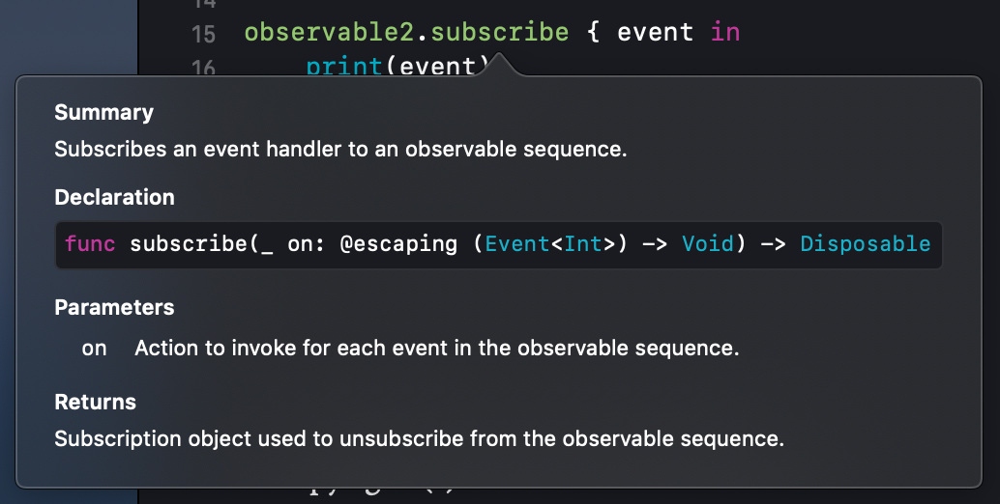
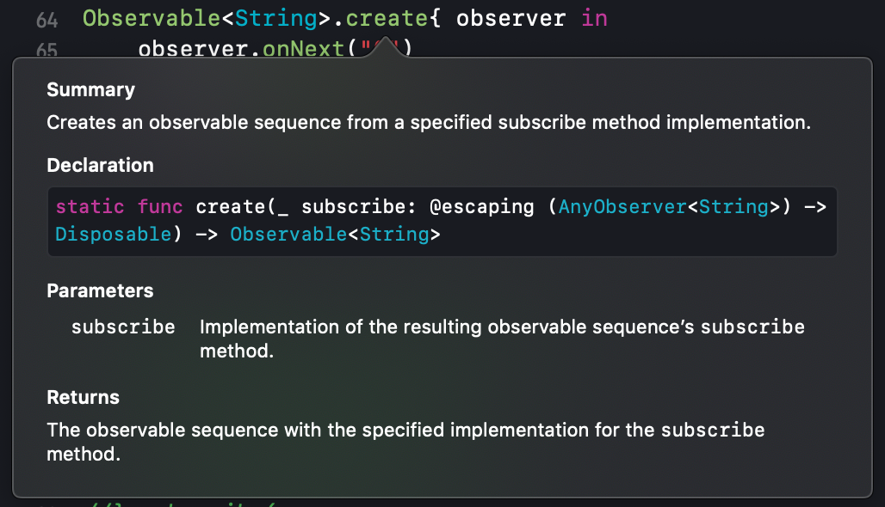
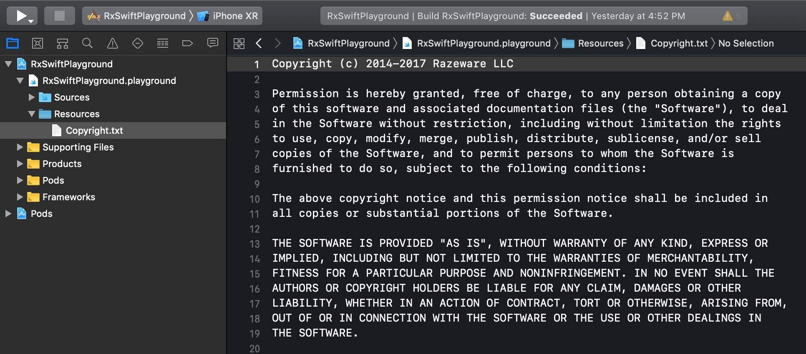

*Written by: __Nguyen Minh Tam__*

#  Section 1: Getting started with RxSwift

##  Chapter 2: Observables

__Menu__
- [Getting started](#getting-started)
- [What is an observable](#what-is-an-observable)
- [Lifecycle of an observable](#lifecycle-of-an-observable)
- [Creating observables](#creating-observables)
- [Subscribing to observables](#subscribing-to-observables)
- [Creating observable factories](#creating-observable-factories)
- [Using Traits](#using-traits)

Trong chapter này, bạn sẽ lướt qua nhiều ví dụ tạo và subcribing observable. Mặc dù observable sử dụng trong real world nhiều trường hợp khá là chuối, cơ mà những phần còn lại sẽ giúp chúng ta đạt được những skill quan trọng và biết được kha khá các loại observable khác nhau.

Trước khi đi vào tìm hiểu sâu hơn, đầu tiên chúng ta cùng tìm hiểu `Observable` là gì đã.

### Getting started

Bắt đầu với `RxSwiftPlayground.xcworkspace` project trong thư mục `./Document/ExampleProject/02-observable-pg/starter/` sau khi chạy `pod install` đã giới thiệu ở [Chapter 1][Chapter 1].

### What is an observable

Các khái niệm như `observable`, `observable sequence` hay `sequence` có thể sử dụng thay thế cho nhau trong Rx, và thật ra thì chúng là cùng một thứ. À mà còn nữa, bạn sẽ thấy khái niệm `stream` được nhắc đến nhiều, đặc biệt là từ những developer đã biết đến reactive programming environment khác trước khi làm quen với RxSwift. `Stream` cũng tương tự như những khái niệm trên, nhưng đối với RxSwift thì chúng ta hay gọi nó là `sequence` chứ không phải `stream` cho nó ngầu. Nói tóm lại là, đối với RxSwift:

```
Everything is a sequence
```

hoặc là những thứ làm việc với một `sequence`. `Observable` là `sequence` kết hợp với vài quyền năng đặc biệt. Một quyền năng quan trọng nhất trong số đó là tính bất đồng bộ. `Observable` phát ra event xuyên suốt một khoảng thời gian. Các event ở đây có thể chứa dữ liệu, ví dụ như `Observable<Int>` có thể chứa số nguyên, hay `Observable<Developer>` chứa instance của kiểu Developer, hoặc nó có thể nhận các gesture như tap chả hạn.

### Lifecycle of an observable

Để mô tả observable một cách trực quan, ta sử dụng marble diagram như sau:

<center>
	
</center>

Trong ví dụ trên, observable phát ra 3 element. Khi observable phát ra 1 element, có nghĩa là nó đang thực hiện một tác vụ next event.

Sau đây là marble diagram khác, nhưng lần này observable được kết thúc bởi một đường kẻ dọc ở phía cuối.

<center>
	
</center>

Observable phát ra 3 event và kết thúc. Gọi là completed event bởi vì sau đó observable này đã kết thúc và không phát thêm bất kỳ một event nào cả. Kết thúc trong trường hợp này là loại kết thúc bình thường. Tuy nhiên, trong một số trường hợp có lỗi phát sinh:

<center>
	
</center>

Một error được biểu thị trên marble diagram bằng dấu X màu đỏ. Observable phát ra một error event contain error. Nó không khác mấy so với khi observable được kết thúc theo cách bình thường. Khi một observable phát một error event, observable sẽ kết thúc và không phát thêm bất kỳ một event nào nữa.

Tóm tắc cho phần này:

- Observable phát next event có chứa dữ liệu. Nó vẫn có thể tiếp tục hoạt động cho đến khi
 - Phát ra error event và kết thúc, hoặc là
 - Phát ra completed event và kết thúc.
- Khi một observable kết thúc, nó sẽ không phát event nữa.

Ví dụ trong RxSwift source code, những event này được khai báo dưới dạng các case của một enumeration:

```swift
/// Represents a sequence event.
///
/// Sequence grammar:
/// **next\* (error | completed)**
public enum Event<Element> {
    /// Next element is produced.
    case next(Element)
    /// Sequence terminated with an error.
    case error(Swift.Error)
    /// Sequence completed successfully.
    case completed
}
```

Bạn thấy đấy, `.next` event chứa một instance của element nào đó, trong khi `.error` event chứa một instance của `Swift.Error` và cuối cùng là `.completed` event chỉ đơn giản là một sự kiện kết thúc và không chứa bất kỳ data nào.

Ô kề, một observable có thể làm được gì thì các bác đã hiểu rồi đấy. Tiếp theo đây các bác sẽ cùng thôi tạo vài cái observable để xem cụ thể nó hoạt động như nào nhé.

### Creating observables

Quay lại với file `RxSwift.playground` và thêm đoạn:

```swift
let one = 1
let two = 2
let three = 3
let observable1 = Observable<Int>.just(one)
let observable2 = Observable.of(one, two, three)
```

Đoạn trên có nghĩa:
- Khai báo vài integer constant.
- Khởi tạo một observable sequence có kiểu Int với duy nhất một element integer `one`.
- Khởi tạo một observable sequence với duy nhất một element integer `one`.
- Khởi tạo một observable sequence với nhiều element: `one`, `two`, `three`.

Method như `just` là type method của kiểu Observable. Tuy nhiên trong Rx, lưu ý là các method đều được gọi là `operator`. Ví dụ số 2 không khai báo kiểu cụ thể, tuy nhiên nó không phải là một array, nó là kiểu `Observable<Int>`. Vậy nên nếu bạn muốn tạo một observable sequence với nhiều element, chỉ cần pass một array vào `of`.


```swift
let observable3 = Observable.of([one, two, three])
```

Option-click vào `observable3` bạn sẽ thấy nó thuộc kiểu `Observable<[Int]>`. Lúc này array là một element, không phải là từng phần tử của nó.

Một operator khác được sử dụng để tạo observable là `from`.

```swift
let observable4 = Observable.from([one, two, three])
```

Tuy nhiên `from` operator lại tạo observable từ kiểu của từng phần tử của array. Option-click vào `observable4` bạn sẽ thấy nó thuộc kiểu `Observable<Int>` thay vì `[Int]`.

Lúc này console của playground khá là trống lúc nàt, vì chúng ta chưa print ra thứ gì cả. Chúng ta sẽ thay đổi điều này bằng cách subscribe observable.

### Subscribing to observables

Nếu bạn là một iOS developer, thì hẳn bạn khá quen thuộc với cách `NotificationCenter` hoạt động. Nó phát notification đến các observer, khác hẳng so với observable. Sau đây là ví dụ observer notification UIKeyboardDidChangeFrame, được handle bởi trailing closure:

```swift
let observer = NotificationCenter.default.addObserver(forName: .UIKeyboardDidChangeFrame, 
	object: nil,
	queue: nil) { notification in
		// Handle receiving notification
	}
```

`subscribe` RxSwift observable cũng tương tự, thay vì gọi bằng `addObserver()` thì bạn gọi `subscribe()`. Một điểm khác biệt nữa, khi cần sử dụng `NotificationCenter` thì phải dùng singleton instance `.default` của nó, nhưng đối với Rx thì các observable tách biệt với nhau. Một điều khá quan trọng, một observable sẽ không send event cho tới khi nó có subscriber. 

```swift
observable2.subscribe { event in
    print(event)
}
```

Option-click vào `subscribe` operator, bạn sẽ thấy escaping closure có Event là kiểu Int và không trả về kết quả, `subscribe` operator trả vể kiểu `Disposable`. Chúng ta sẽ nhắc tới `Disposable` ở phần sau.

<center>
	
</center>


Kết quả của đoạn lệnh trên là in ra từng event được phát ra bởi observable.

```
next(1)
next(2)
next(3)
completed
```

Observable phát `.next` event ứng với mỗi element, sau cùng phát `.completed` event rồi terminated. Để truy cập vào element của `.next` event, sử dụng đoạn code sau.

```swift 
observable2.subscribe { event in
    print(event.element)
}
```

Event sở hữu `element` property, nó là optional value, bởi chỉ có `.next` event mới có element. Vậy nên kết quả nhận được lúc này như sau.

```
Optional(1)
Optional(2)
Optional(3)
nil
```

Cú pháp ngắn gọn phía trên rất hay được sử dụng trong RxSwift. Bên cạnh nó, còn có một `subscribe` operator khác xử lý từng loại event mà observable phát ra: `next`, `error` và `completed`.

```swift
observable2.subscribe(onNext: { element in
    print(element)
})
```

Kết quả thu được.

```
1
2
3
```

> Note: Tạm thời chúng ta sẽ bỏ qua cách handle những event còn lại rồi quay lại sau.

Bây giờ bạn đang handle element của `.next` event và bỏ qua những thứ kia. Closure `onNext` lúc này nhận element trong `.next` event làm đối số của nó, vì thế cho nên bạn không cần phải unwrap optional mới lấy được giá trị của element.

Bạn đã hiểu được cách tạo ra một observable có một hoặc nhiều element. Nhưng điều gì xảy ra khi observable không có element nào? Lúc này `empty` operactor giúp tạo ra một empty observable sequence không có element nào cả, nó chỉ phát ra duy nhất một event `.completed` rồi terminated.

```swift
let observable5 = Observable<Void>.empty()
observable5.subscribe{ event in
    print(event)
}
```

Kết quả thu được.

```
completed
```

Observable phải được khai báo kiểu xác định trong trường hợp nó không tự suy được. Vậy đối với trường hợp empty như thế này thì không thể tự suy ra kiểu được, nên ta sẽ khai báo kiểu Void.

```swift
observable5.subscribe(onNext: { element in
    print(element)
}, onCompleted: {
    print("Completed")
})
```

Đoạn code này có kết quả giống với đoạn trước đó vì observable chỉ phát ra duy nhất `.completed` event.

Vấn đề là sử dụng empty observable làm gì giờ? Câu trả lời là khi bạn cần một observable có thể terminate ngay lập tức hoặc cố ý không phát ra element nào.

Trái với `empty` operator, `never` operator tạo ra một observable không bao giờ phát ra bất kỳ thứ gì và cũng không bao giờ terminate. Nó có thể được sử dụng để biểu diễn infinite duration.

```swift
let observable6 = Observable<Any>.never()
observable6.subscribe(onNext: { element in
    print(element)
}, onCompleted: {
    print("Completed")
})
```

Chả có gì được in ra thậm chí là "Completed".

Mở rộng thêm một chút nữa, ta có thể tạo ra một observable từ một dãy các giá trị bằng cách sử dụng `range` operator.

```swift
let observable7 = Observable<Int>.range(start: 0, count: 9)
observable7.subscribe(onNext: { element in
    print(element)
}, onCompleted: {
    print("Completed")
})
```

Kết quả thu được.

```
0
1
2
3
4
5
6
7
8
9
Completed
```

### Disposing and terminating

Lưu ý một observable sẽ không làm gì chỉ cho đến khi nó được subscribe. subscription sẽ trigger observable, sau đó observable bắt đầu phát event, đến khi nó phát event `.error` hoặc `. completed` và terminated. Bạn có thể tự điều chỉnh terminate observable bằng việc cancel subscription đến observable đó.

```swift
let observable8 = Observable.of("A", "B", "C")
let subscription8 = observable8.subscribe { event in
    print(event)
}
subscription8.dispose()
```

Đoạn code trên khá đơn giản:
- Tạo một observable phát ra một số string.
- subscribe observable, như đã đề cập ở phần `Subscribing to observables` phía trên, kết quả của `subscribe` operator trả về kiểu `Disposable`.
- In mỗi event được phát ra.
- Để cancel một subscription, gọi `dispose()`. Sau khi bạn cancel subsciption, hay còn gọi là dispose nó, observable sẽ dừng việc phát ra event.

Việc phải quản lý cho mỗi subscription sẽ rấy là chán, bởi bậy RxSwift giới thiệu kiểu `DisposeBag`. Một dispose bag có thể giữ nhiều disposable, được thêm vào bởi method `.disposed(by:)` và nó sẽ tự gọi `dispose()` cho mỗi disposable khi dispose bag sắp được giải phóng.

```swift
let disposeBag = DisposeBag()
Observable.of("A", "B", "C").subscribe {
    print($0)
}.disposed(by: disposeBag)
```

Đây là cách đoạn code trên hoạt động:

- Tạo ra một dispose bag.
- Tạo ra một observable.
- subscribe observable và in mỗi event được phát ra.
- Cuối cùng là thêm giá trị disposable mới được tạo ra vào dispose bag.

Pattern này bạn sẽ sử dụng rất là nhiều khi làm việc với Rx: khi tạo và subscribing một observable và ngay lập tức add subscription vào dispose bag.

__Lưu ý__: Nếu bạn quên thêm subscription vào dispose bag hoặc không tự gọi `dispose()` khi kết thúc subscribe hoặc trong một số trường hợp observable bị terminated, sẽ dẫn đến `leak memory`. Cũng đừng lo lắng quá, Swift compiler sẽ cảnh báo bạn các case trên.

Ở ví dụ phía trên, bạn đã tạo ra được observable với `.next` event xác định với operator `of`. Một cách khác định nghĩa tất cả các event mà một observable sẽ phát ra là bằng cách sử dụng `create` operator.

```swift
Observable<String>.create{ observer in
    observer.onNext("0")
    observer.onCompleted()
    observer.onNext("?")
    return Disposables.create()
}
```

`create` operator chỉ có duy nhất một parameter `subscribe`. Công việc của nó là chỗ để định nghĩa tất cả các event sẽ được phát tới subscriber. Option-click lên `create` operator bạn sẽ thất rằng `subscribe` parameter là một escaping closure lấy các giá trị `AnyObserver` làm đầu vào và trả về `Disposable`.

<center>
	
</center>

Lưu ý ở bước cuối cùng, escaping closure trả về `Disposable` khá là kỳ cục phải không. Nhưng mà lướt lên phía trên đi, các `subscribe` operator đều trả về `Disposable` mà. 

Ở đây `Disposables.create()` có tác dụng khác nữa. Bạn có thể dễ dàng đoán được event `.onNext("?")` sẽ không được phát ra phải không? Hãy cùng check lại suy đoán của các bạn nhé, bằng cách `subscribe` observable trên và implement closure của `subcribe` như sau.

```swift
let disposeBag = DisposeBag()
Observable<String>.create{ observer in
    observer.onNext("0")
    observer.onCompleted()
    observer.onNext("?")
    return Disposables.create()
}.subscribe(
    onNext: { print($0) },
    onCompleted: { print("Completed") },
    onDisposed: { print("Disposed") }
).disposed(by: disposeBag)
```

Well well, kết quả thu được.

```
0
Completed
Disposed
```

Điều gì xảy ra khi bạn thêm error vào observer đây? Và xảy ra như thế nào nếu phát `.error` event trước `.completed` event đây? Trước hết ta hãy tạo ra một kiểu Error với một case someError rồi kiểm chứng sau.

```swift
enum MyError: Error {
    case someError
}
let disposeBag = DisposeBag()
Observable<String>.create{ observer in
    observer.onNext("0")
    observer.onError(MyError.someError)
    observer.onCompleted()
    observer.onNext("?")
    return Disposables.create()
}.subscribe(
    onNext: { print($0) },
    onError: { print($0) },
    onCompleted: { print("Completed") },
    onDisposed: { print("Disposed") }
).disposed(by: disposeBag)
```

Kết quả thu được là observable phát ra error sau đó thì terminated luôn.

```
0
someError
Disposed
```

Lại kiểm chứng một trường hợp khác, không phát `.error` event lẫn `.completed` event thì kết quả sẽ như thế nào?

```swift
let disposeBag = DisposeBag()
Observable<String>.create{ observer in
    observer.onNext("0")
    observer.onNext("?")
    return Disposables.create()
    }.subscribe(
        onNext: { print($0) },
        onError: { print($0) },
        onCompleted: { print("Completed") },
        onDisposed: { print("Disposed") }
    ).disposed(by: disposeBag)
```

Kết quả là.

```
0
?
```

🎉 Bạn có biết rằng bạn vừa `leak memory` không? Observable lúc này sẽ không bao giờ kết thúc, và disposable lúc này sẽ không bao giờ được dispose. Vậy nên nhớ thêm `observer.onCompleted()` sau `observer.onNext("?")` nhé.

### Creating observable factories

Thay vì tạo ra một observable chờ subscriber, chúng ta có thể tạo ra observable factory có thể tạo ra observable mới đến mỗi subscriber với method `deferred`.

```swift
let disposeBag = DisposeBag()
var flip = false
let factory: Observable<Int> = Observable.deferred {
    flip != flip
    if flip {
        return Observable.of(1, 2, 3)
    } else {
        return Observable.of(4, 5, 6)
    }
}
```

Ý nghĩa của đoạn code trên:

- Tạo ra một biến Bool `flip`. Dựa vào giá trị của `flip` mà xác định kết quả trả về của observable.
- Tạo một observable factory kiểu Int bằng cách dùng `deferred` operator.
- Đảo giá trị biến `flip` mỗi lần factory được subscribe.
- Trả về observable khác nhau dựa trên giá trị true/false của biến `flip`.

Xét nhiều mặt thì observable factory không khác biệt mất so với observable bình thường.

```swift
for _ in 0...3 {
    factory.subscribe(onNext: {
        print($0, terminator: " ")
    }).disposed(by: disposeBag)
    print("")
}
```

Mỗi lần bạn subscribe factory, bạn sẽ nhận kết quả observabele khác với kết quả trước: `1 2 3`, đến `4 5 6`, và lặp lại.

```
1 2 3 
4 5 6 
1 2 3 
4 5 6 
```

### Using Traits

Trait là observable có ít behavior hơn các observable bình thường. Mục đích của nó là diễn dạt rõ hơn thứ mà bạn muốn hướng đến ở trong code. Ngữ cảnh được đặt ra trong khi sử dụng trait có thể làm đoạn code của bạn dễ hiểu hơn.

Có ba loại trait trong RxSwift: `Single`, `Maybe`, và `Completable`. Chắc bạn sẽ đoán ngay nó có tác dụng gì cho dù chưa tiếp xúc với chúng lần nào.

- `Single` phát hoặc là `.success(value)` hoặc là `.error` event:
	- `.success(value)` bao gồm `.next` và `.completed` event. 
	- Hữu dụng đối với các process như tải dữ liệu: tải một lần hoặc sẽ thành công hoặc là thất bại.
- `Completable` phát ra duy nhất một event `.completed` hoặc `.error`. Nó không phát ra các giá trị. Bạn có thể sử dụng `Completable` khi bạn quan tâm tới operation được hoàn thành thành công hay thất bại. Ví dụ như kết quả khi ghi vào file.
- `Maybe` kết hợp `Single` và `Completable`.

Chúng ta sẽ tìm hiểu sâu hơn ở Chapter 4. Còn bây giờ, mình sẽ giới thiệu các ví dụ đơn giản về sử dụng `Single` để load file chứ text tên `Copyright.txt` thư mục `Resource`.

<center>
	
</center>

```swift
enum FileReadError: Error {
    case fileNotFound, unreadable, encodingFailed
}

func loadText(from name: String) -> Single<String> {
    return Single.create { single in
        let disposable = Disposables.create()
        guard let path = Bundle.main.path(forResource: name, ofType: "txt") {
            single(.error(FileReadError.fileNotFound))
            return disposable
        }
        guard let data = FileManager.default.contents(atPath: path) else {
            single(.error(FileReadError.unreadable))
            return disposable
        }
        guard let contents = String(data: data, encoding: .utf8) else {
            single(.error(FileReadError.encodingFailed))
            return disposable
        }
        single(.success(contents))
        return disposable
    }
}
```

- Khai báo kiểu `enum FileReadError` mô tả các trường hợp lỗi có thể xảy ra khi đọc dât từ file trên disk.
- Khai báo function `loadText(from name: String)` trả về kiểu `Single<String>`.
	- Trong function trên tạo mới và trả về một instance `Single` bằng `create` operator.
	- Implement closure `subscribe` của `create` operator, biết rằng closure này trả về kiểu `Disposable` theo trình tự sau:
		- Tạo một instance `Disposable`
		- Lấy path từ file name, nếu không được thì add error `.fileNotFound` vào `single` rồi trả về instance `Disposable` đã tạo ở trên.
		- Lấy data từ path đó, nếu không được thì add error `.unreadable` vào `single` rồi trả về instance `Disposable` đã tạo ở trên.
		- Convert dât ra string, nếu không được thì add error `.encodingFailed` vào `single` rồi trả về instance `Disposable` đã tạo ở trên.
		- Nếu đã pass tất cả các bước trên, thì add success content đã convert được vào `single` rồi trả về instance `Disposable` đã tạo ở trên.

Để kiểm tra đoạn code trên hoạt động được hay không, dùng đoạn code sau:

```swift
let disposeBag = DisposeBag()

loadText(from: "Copyright")
    .subscribe {
        switch $0 {
        case .success(let string):
            print(string)
        case .error(let error):
            print(error)
        }
    }
    .disposed(by: disposeBag)
```

Kết quả thu được.

```
Copyright (c) 2014-2017 Razeware LLC
...
```

Thử thay đổi tên của filename, lúc này bạn sẽ nhận được `.fileNotFound` error được in ra.

## More

Quay lại chapter trước [Chapter 1: Hello RxSwift][Chapter 1]

Đi đến chapter sau [Chapter 3: Subjects][Chapter 3]

Quay lại [RxSwiftDiary's Menu][Diary]

---
[Chapter 1]: ./Section1-Chapter1.md "Hello RxSwift"
[Chapter 3]: ./Section1-Chapter3.md "Subjects"
[Diary]: https://github.com/nmint8m/rxswiftdiary "RxSwift Diary"
