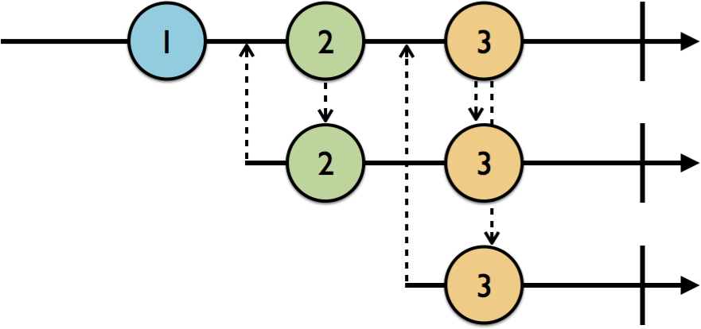
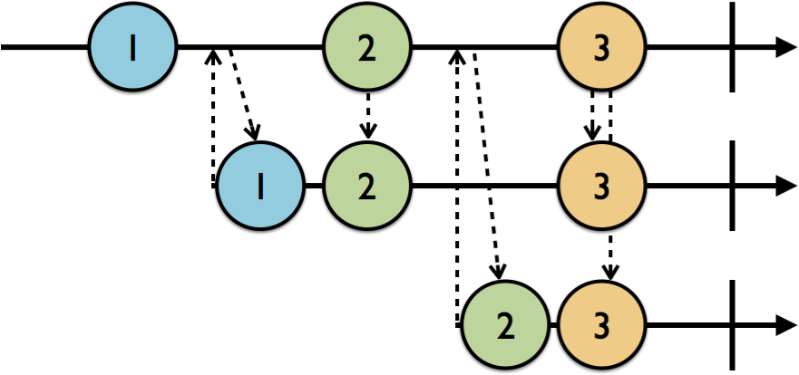
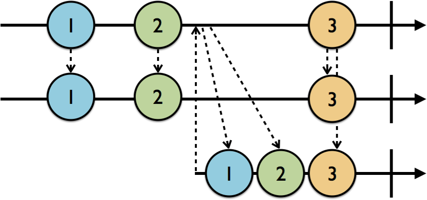

*Written by: __Nguyen Minh Tam__*

#  Section 1: Getting started with RxSwift

##  Chapter 3: Subjects

Ở phần trước, chúng ta đã biết được observable là gì, cách tạo ra, subscibe nó như thế nào và dispose nó ra sao. Observable là một thành phần cơ bản của RxSwift, tuy nhiên cái mà chúng ta thực sự cần khi develop app là tạo new value và add nó vào observable lúc run time, và những value này được phát tới các subscriber. Cái mà chúng ta thực sự cần là một thứ vừa có thể hành động như một observable (phát) và như một observer (thu). Thành phần đó được gọi là `Subject`.

Trong phần này chúng ta sẽ tìm hiểu các loại subject khác nhau trong RxSwift, cách hoạt động của nó như thế nào, và tại sao chúng ta sẽ chọn loại subject nhất định dựa vào use case được áp dụng.

__Menu__

- [Getting started](#getting-started)
- [What are subjects?](#what-are-subjects)
- [Working with publish subjects](#working-with-publish-subjects)
- [Working with behavior subjects](#working-with-behavior-subjects)
- [Working with replay subjects](#working-with-replay-subjects)
- [Working with variables](#working-with-variables)

### Getting started

Sau khi chạy `pod install`, mở `RxSwiftPlayground.xcworkspace` project trong thư mục `./Document/ExampleProject/03-subjects-and-variable/starter/`.

Đây là cách tạo một `PublishSubject`.

```swift
let subject = PublishSubject<String>()
```

Giống như nhà xuất bản báo (newspaper publisher), nó sẽ nhận thông tin, và quay ngược lại publish cho các subscriber. Publish subject phía trên có kiểu `String`, cho nên nó chỉ nhận kiểu `String` và publish kiểu `String`. Sau khi được initial, nó bắt đầu có thể nhận thông tin.

```swift
subject.onNext("Is anyone listening?")
```

Đoạn này, một string được đưa vào subject, nhưng chưa có bất kỳ thông tin nào được in ra vì chưa có observer. Dòng code sau sẽ giúp tạo một subscription của `subject`, nó sẽ in ra element mỗi khi nhận được `.next` event.

```swift
let subscriptionOne = subject.subscribe(onNext: { print($0) })
```

Nhưng console lúc này vẫn trống, vì sao vậy? Bởi vì `PublishSubject` chỉ phát event đến cho những subscriber hiện tại đang subscibe nó. Vậy nên nếu chúng ra không thể observer được những thông tin đã được phát trong quá khứ tính từ thời điểm bắt đầu subscribe.

Vấn đề được xử lý khi thêm đoạn code sau.

```swift
subject.onNext("1")
```

> __Lưu ý:__ Câu lệnh `subject.onNext("1")` tương đương với `subject.on(.next("1"))`. Cách đầu dễ đọc hơn cách thứ hai.

Kết quả thu được.

```
1
```

Chúng ta vừa mới đi qua một khởi đầu nhẹ nhàng, ở phần dưới chúng ta sẽ tìm hiểu sâu hơn về subject.

### What are subjects?

Subject hoạt động vừa là observable, vừa là observer. Ta đã thấy cách mà nó nhận event và được subscribe tới ở phía trên.

- Subject nhận vào `.next` event -> Subject là observer
- Mỗi khi subject nhận một event thì nó sẽ quay ngược lại và phát event cho các subscriber của nó. -> Subject là observable

Có bốn loại subject trong RxSwift:

- `PublishSubject`: Bắt đầu với giá trị rỗng và chỉ phát new value khi đến subsciber.
- `BehaviorSubject`: Bắt đầu với một giá trị khởi tạo, sau đó lặp lại nó hoặc lặp lại element mới nhất đến subscriber mới.
- `ReplaySubject`: Được khởi tạo với một buffer size nhất định và duy trì số lượng element được replay tới subscriber tương ứng với buffer size đó.
- `Variable`: Nó giống như một `BehaviorSubject`, giữ các giá trị hiện tại thành `state`, và chỉ phát lại duy nhất giá trị mới nhất hoặc giá trị khởi tạo cho những subscriber mới.

### Working with publish subjects

`PublishSubject` được sử dụng khi subscriber sẽ được notify chỉ bởi những event được phát kể từ thời điểm nó đăng ký subscribe observable trở đi, cho đến khi nào chúng unsubscribe hoặc là subject đó bị terminate bởi event `.completed` hoặc `.error`.

<center>
	
</center>

Vì subscription thứ hai subscribe sau khi `1` được phát, vậy nên nó sẽ không nhận được event `1`, mà chỉ nhận được event `2` và `3`. Tương tự, subscription thứ ba chỉ nhận được event `3`.

Đoạn code sau mô tả model phía trên:

```swift
let subject = PublishSubject<String>()
subject.onNext("Is anyone listening?")
let subscriptionOne = subject.subscribe(onNext: { print("Subcriber 1: \($0)") })
subject.onNext("1")
let subscriptionTwo = subject.subscribe(onNext: { print("Subcriber 2: \($0)") })
subject.onNext("2")
let subscriptionThree = subject.subscribe(onNext: { print("Subcriber 3: \($0)") })
subject.onNext("3")
```

Kết quả thu được.

```
Subcriber 1: 1
Subcriber 1: 2
Subcriber 2: 2
Subcriber 1: 3
Subcriber 2: 3
Subcriber 3: 3
```

Bạn dễ dàng thấy được `3` được in ra 3 lần vì nó được phát ra sau khi `subscriptionOne`, `subscriptionTwo` và `subscriptionThree` đăng ký subscribe `subject`.

Nếu tiếp tục thêm đoạn code sau vào dưới đoạn code viết ở trên:

```swift
subscriptionOne.dispose()
subject.onNext("4")
```

Lúc này `4` chỉ được in ra 2 lần bởi `subscriptionTwo` và `subscriptionThree`, bởi `subscriptionOne` đã bị `dispose` từ lúc nãy.

```
Subcriber 2: 4
Subcriber 3: 4
```

Khi public subject nhận `.completed` hoặc `.error` event (stop event), nó sẽ phát những stop event này cho các subscriber và nó sẽ không tiếp tục phát `.next` event nữa. 

Thử đoạn code sau:

```swift
let disposeBag = DisposeBag()
let subject = PublishSubject<String>()
subject.subscribe(onNext: { print($0) },
                  onCompleted: { print("onCompleted") },
                  onDisposed: { print("onDisposed") })
    .disposed(by: disposeBag)
subject.onCompleted()
```

Đây là những gì chúng ta làm:

- Khởi tạo một dispose bag và một subject.
- Subscribe subject, nó sẽ in ra element nếu nhận `.next` event, in ra `onCompleted` khi nhận `.completed` event và in ra `onDisposed` khi subject đã dispose.
- Các bạn hãy tập thói quen thêm subscription vào dispose bag để luôn đảm bảo không leak memory.
- Đưa `.completed` event vào subject. Nó sẽ terminate observable sequence của subject.

Kết quả thu được như sau:

```
onCompleted
onDisposed
```

Mọi loại subject, khi nào bị terminate, nó sẽ phát lại stop event cho các subscriber của nó. 

### Working with behavior subjects

`BehaviorSubject` hoạt động tương tự như `PublishSubject`, ngoại trừ nó sẽ replay `.next` event mới nhất đến subscriber. Xem marble diagram dưới đây:

<center>
	
</center>

Ở đây, dòng đầu tiên là một subject. Subscriber đầu tiên là ở dòng thứ hai, subscriber này subscribe sau khi event `1` được phát nhưng trước event `2`, nó sẽ ngay lập tức nhận được event `1` ngay khi vừa subscribe và nhận event `2`, `3` sau đó khi nó được phát.

Tương tự subscriber thứ hai subscribe sau event `2` được phát nhưng trước event `3`, vậy nên nó sẽ nhận được event `2` ngay lập tức, và nhận event `3` được phát sau đó.

```swift
let disposeBag = DisposeBag()
let subject = BehaviorSubject<String>(value: "1")
subject.subscribe{ print("Subscriber 1: \($0)") }
    .disposed(by: disposeBag)
subject.onNext("2")
subject.subscribe{ print("Subscriber 2: \($0)") }
    .disposed(by: disposeBag)
subject.onNext("3")
```

Kết quả thu được:

```
Subscriber 1: next(1)
Subscriber 1: next(2)
Subscriber 2: next(2)
Subscriber 1: next(3)
Subscriber 2: next(3)
```
Điều gì xảy ra khi thêm `.error` event vào behavior subject và tạo mới một subscription đế subject?

```swift
subject.subscribe{ print("Subscriber 3: \($0)")}
subject.onError(MyError.someError)
```

Kết quả thu được là subscriber thứ ba sẽ lặp lại 

```
Subscriber 1: error(someError)
Subscriber 2: error(someError)
Subscriber 3: error(someError)
```

Behavior subject hữu dụng khi chúng ta muốn hiển thị data mới nhất lên view. Ví dụ chúng ta có thể bind các control trong màn hình profile vào một behavior subject, nhờ đó các dữ liệu mới nhất vận có thể được hiển thị trong khi app đang fetch dữ liệu mới về.

Nhưng đặt trường hợp chúng ta cần hiển thị nhiều hơn một giá trị gần nhất thì sao. Ví dụ ở màn hình search, chúng ta muốn hiển thị 5 từ khoá được search gần nhất thì sao. Đối với những trường hợp như vậy replay subject được áp dụng.

### Working with replay subjects

`ReplaySubject` sẽ tạm thời lưu trữ (buffer) những elements gần nhất được phát ra với một số lượng được định sẵn, sau đó phát lại buffer đó đến các subscriber mới.

Theo dõi marble diagram sau đây đang mô tả một replay subject với buffer size là 2. Subscriber đầu tiên (được mô tả ở dòng thứ hai), đã subscribe replay subject (được mô tả ở dòng đầu tiên), cho nên nó nhận được event `1`, `2` được phát tới nó. Subscriber thứ hai là một subscriber mới (được mô tả ở dòng thứ ba) subscribe replay subject sau khi event `2` được phát, tuy nhiên nó vẫn sẽ nhận được cả event `1` và `2` vốn đã được phát trước đó.

<center>
	
</center>

Lưu ý khi sử dụng replay subject, buffer sẽ được giữ lại trong bộ nhớ, vì vậy không nên khai báo buffer size quá lớn, đặc biệt là đối với những kiểu tiêu tốn nhiều bộ nhớ như image. 

Thêm một điều cần lưu ý nữa khi tạo ra một replay subject có kiểu là array. Mỗi element được phát ra là một array, cho nên buffer size của nó sẽ là nhiều array. Vậy nên nó rất dễ tiêu tốn bộ nhớ nếu bạn không cẩn thận.

Thử đoạn code sau trong playground:

```swift
let disposeBag = DisposeBag()
let subject = ReplaySubject<String>.create(bufferSize: 2)
subject.onNext("1")
subject.onNext("2")
subject.subscribe { print("Subscriber 1: \($0)") }
    .disposed(by: disposeBag)
subject.onNext("3")
subject.subscribe { print("Subscriber 2: \($0)") }
    .disposed(by: disposeBag)
```

Kết quả thu được:

```
Subscriber 1: next(1)
Subscriber 1: next(2)
Subscriber 1: next(3)
Subscriber 2: next(2)
Subscriber 2: next(3)
```

Tiếp theo, so sánh kết quả của hai đoạn code sau:

```swift
let disposeBag = DisposeBag()
let subject = ReplaySubject<String>.create(bufferSize: 2)
subject.onNext("1")
subject.onNext("2")
subject.onError(MyError.someError)
subject.subscribe{ print("Subscriber 3: \($0)")}.disposed(by: disposeBag)
```

```
Subscriber 3: next(1)
Subscriber 3: next(2)
Subscriber 3: error(someError)
```

Và:

```swift
let disposeBag = DisposeBag()
let subject = ReplaySubject<String>.create(bufferSize: 2)
subject.onNext("1")
subject.onNext("2")
subject.onError(MyError.someError)
subject.dispose()
subject.subscribe{ print("Subscriber 4: \($0)")}.disposed(by: disposeBag)
```

```
Subscriber 4: error(Object `RxSwift.(unknown context at 0x1230adc98).ReplayMany<Swift.String>` was already disposed.)
```

Chuyện gì xảy ra với subscriber 3 vậy? Replay subject đáng lẽ phải bị terminate bởi error, mà error này lại được phát lại tới subscriber mới. Câu trả lời là bởi vì buffer vẫn còn được duy trì, cho nên nó sẽ được replay lại tới subscriber mới. Vậy nên trước khi stop event này được phát lại, thêm dòng code `subject.dispose()` như ở ví dụ subscriber 4. Bằng cách gọi trực tiếp `dispose()`, subscriber mới sẽ chỉ nhận được error event thông báo rằng replay subject đã được disposed.

Thường thì chúng ta sẽ không trực tiếp gọi `dispose()` cho replay subject, bởi vì ta sẽ thêm các subscription vào dispose bag (tránh tạo ra strong reference life cycle), và mọi thứ sẽ được dispose và deallocate khi owner của nó bị deallocate.

Tóm lại, bằng cách sử dụng publish, behavior hay replay subject, chúng ta đã có thể handle khá là nhiều thứ rồi. Nhưng đôi lúc, bạn cần Variable để thực hiện một số task, cùng tìm hiểu trong phần dưới nhé.

### Working with variables

Như đã đề cập lúc đầu, `Variable` bọc `BehaviorSubject` lại và giữ các gía trị hiện tại thành `state`. Chúng ta có thể access current value thông qua property `value`. Tuy nhiên, không giống những subject và những observable khác, chúng ta cũng có thể sử dụng property `value` đó để set element mới vào variable. Nói cách khác là chúng ta không cần phải gọi `onNext(_:)` nữa.

Bởi vì nó giống như behavior subject, cho nên variable được khởi tạo với initial value và nó phát lại giá trị initial value hoặc là giá trị mới nhất tới new subscriber. Để có thể access variable dưới dạng một observable, chúng ta gọi `asObservable()` cho nó.

Variable khác với các subject khác ở đặc điểm là: 
- Nó không phát `.error` event. Vậy nên là bạn có thể lắng nghe `.error` event nhưng không thể add `.error` event vào variable. 
- Variable tự động complete khi nó sắp bị deallocated, vậy nên chúng ta cũng không cần phải add `.completed` event vào variable.

```swift
example(of: "Variable") {
    let disposeBag = DisposeBag()
    let variable = Variable<String>("1")
    variable.asObservable()
        .subscribe{ print("Subscriber 1: \($0)") }
        .disposed(by: disposeBag)
    variable.value = "2"
}
```

Kết quả thu được:

```
Subscriber 1: next(1)
Subscriber 1: next(2)
Subscriber 1: completed
```

Chúng ta có thể sử dụng variable như observable khi chúng ta chỉ muốn nhận `.next` event mới nhất được phát và bỏ qua những khác.

## More

Quay lại chapter trước [Chapter 2: Observables][Chapter 2]

Đi đến chapter sau [Chapter 4: Observables and Subjects in Practice][Chapter 4]

Quay lại [RxSwiftDiary's Menu][Diary]

---
[Chapter 2]: ./Section1-Chapter2.md "Observables"
[Chapter 4]: ./Section1-Chapter4.md "Observables and Subjects in Practice"
[Diary]: https://github.com/nmint8m/rxswiftdiary "RxSwift Diary"
