_Written by: **Nguyen Minh Tam**_

# Section I: Getting started with RxSwift

## Chapter 4: Observables and Subjects in practice

Tính đến thời điểm này, chúng ta đã có thể hiểu được cách hoạt động của observable và của các loại subject khác nhau và học được cách khởi tạo, cách làm việc với chúng qua playground.

Trong chapter này, chúng ta sẽ làm việc với một app hoàn thiện để hiểu được cách sử dụng observable trong thực tế, như: binding UI vào data model hoặc present new controller và cách nhận output từ observable. Chúng ta sẽ sử dụng sức mạnh siêu nhiên của RxSwift để tạo ra app cho phép người dùng tạo ra photo collage. Let's do it! 🎉

**Menu**

- [Getting started](#getting-started)
- [Using a variable in a view controller](#using-a-variable-in-a-view-controller)
- [Talking to other view controllers via subjects](#talking-to-other-view-controllers-via-subjects)
- [Creating a custom observable](#creating-a-custom-observable)
- [RxSwift traits in practice](#rxswift-traits-in-practice)
- [Completable](#completable)
- [Challenge](#challenge)

### Getting started

Sau khi chạy `pod install`, mở `Combinestagram.xcworkspace` trong thư mục `./Document/ExampleProject/04-observables-in-practice/starter/`.

Chọn `Main.storyboard` và bạn sẽ thấy app interface như sau:

<center>
	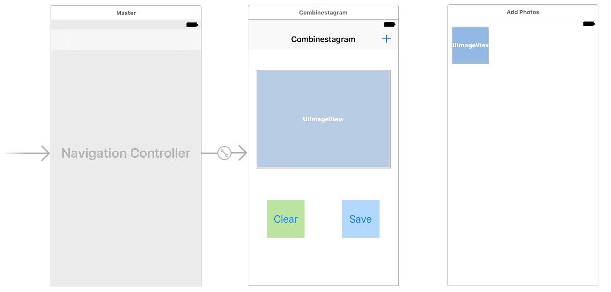
</center>

App flow như sau:
- Màn hình đầu tiên, user có thể thấy photo collage hiện tại.
- Một nút để clear list photo hiện tại.
- Một sút để save collage vào bộ nhớ.
- Khi user tap vào nút `+` góc trên bên phải, user được chuyển đến màn hình thứ hai chứa list photo trong Camera Roll. User lúc này có thể add thêm photo vào collage bằng cách chọn thumbnail.

Ở đây cái view controller và storyboard đã được kết nối với nhau, chúng ta có thể chọn file `UIImage+Collage.swift` để xem cách một collage thực tế được xây dựng như thế nào.

Điều quan trọng ở đây là chúng ta sẽ học cách vận dụng những skill mới vào thực tế. Time to get started! 🎉


### Using a variable in a view controller

Chúng ta sẽ bắt đầu bằng việc thêm một property Variable<[UIImage]> vào controller class để lưu các photo được chọn vào value của nó.

Mở `MainViewController.swift` và thêm đoạn code sau:

```swift
private let disposeBag = DisposeBag()
private let images = Variable<[UIImage]>([])
```

Bởi vì property `disposeBag` được sở hữu bởi view controller, vậy nên khi view controller release thì các observable được thêm vào `disposeBag` sẽ bị dispose theo. Điều này khiến cho việc quản lý bộ nhớ của các subscription hết sức dễ dàng: chỉ bằng việc quăng subscription vào bag và nó sẽ bị dispose khi view controller bị deallocate.

<center>
	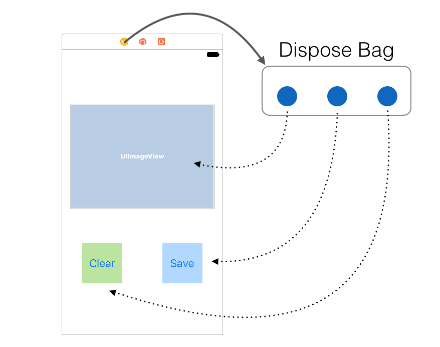
</center>

Tuy nhiên, quá trình trên sẽ không xảy ra đối với một số view controller nhất định, ví dụ như đối với trường hợp nó là root view controller, nó sẽ không bị release trước khi tắt app. Chúng ta sẽ tìm hiểu về cách thức hoạt động của quá trình `dispose-upon- deallocation` ở phần sau của chapter này.

Lúc đầu, app của chúng ta sẽ luôn luôn hiển thị một collage có nhiều ảnh giống nhau, là ảnh mèo được add sẵn trong `Assets.xcassets`. Mỗi lần user tap vào `+`, chúng ta sẽ add thêm ảnh vào variable `images`.

Tìm tới function `actionAdd()` và add đoạn code sau:

```swift
guard let image = UIImage(named: "img-cat.jpg") else { return }
images.value.append(image)
```

Giá trị khởi tạo của variable `images` là một mảng rỗng, vậy nên mỗi khi user tap nút `+`, observable sequence được tạo bởi `images` sẽ phát `.next` event với element là một array mới.

Để cho phép user clear lựa chọn, add code sau vào funtion `actionClear()`:

```swift
images.value = []
```

Với những đoạn code ngắn trên, chúng ta đã có thể handle user input tốt rồi. Bây giờ chúng ta sẽ sang phần lắng nghe `images` và hiển thị kết quả lên screen.

#### Adding photos to the collage 

Trong function `viewDidLoad()`, khởi tạo subscription tới `images`. Và nhớ rằng vì `images` là variable nên ta phải dùng `asObservable()` để có thể subscribe tới nó:

```swift
        images.asObservable()
            .subscribe(onNext: { [weak self] photos in
                guard let this = self,
                let preview = this.imagePreview else { return }
                preview.image = UIImage.collage(images: photos,
                                                size: preview.frame.size)
            }).disposed(by: disposeBag)
```

Ở chapter này, chúng ta sẽ học cách subscribe observable trong `viewDidLoad()`. Trong những chapter cuối, chúng ta sẽ học cách triển khai subscribe observable vào các class tách biệt, và ở chapter cuối cùng, chúng ta sẽ học về MVVM.

Bây giờ thử chạy app nào!

<center>
	
</center>

#### Driving a complex view controller UI 

Khi sử dụng app hiện tại, chúng ta có thể dễ để ý thấy có một số điểm cần cải thiện về mặt UX, ví dụ như:

- Disable clear button khi không có ảnh nào được chọn hoặc sau khi user tab clear button.
- Tương tự đối với save button.
- Nên disable save button khi trống chỗ trên collage trong trường hợp ảnh bị lẻ.
- Nên giới hạn số ảnh trong khoảng 6 ảnh.
- Nên hiển thị title của view controller cho biết current selection là gì.

Nếu đọc kỹ danh sách yêu cầu trên, chúng ta có thể nhận thấy việc thay đổi có thể gặp một chút phức tạp khi implement bởi cách non-reactive.

May là RxSwift cho phép subscribe `images` nhiều lần, thêm đoạn code sau vào trong function `viewDidLoad()`:

```swift
		images.asObservable()
            .subscribe(onNext: { [weak self] photos in
                guard let this = self else { return }
                this.updateUI(photos: photos)
            }).disposed(by: disposeBag)
```

Trong đó:

```swift
	private func updateUI(photos: [UIImage]) {
        buttonSave.isEnabled = photos.count > 0 && photos.count % 2 == 0
        buttonClear.isEnabled = photos.count > 0
        itemAdd.isEnabled = photos.count < 6
        title = photos.count > 0 ? "\(photos.count) photos" : "Collage"
    }
```

Đoạn code trên gíup chúng ta cập nhật UI theo các rule ở trên. Các logic được gom lại một chỗ và có thể dễ dàng đọc hiểu. Chạy app lại nào và thử xem các rule được áp dụng ra sao:

<center>
	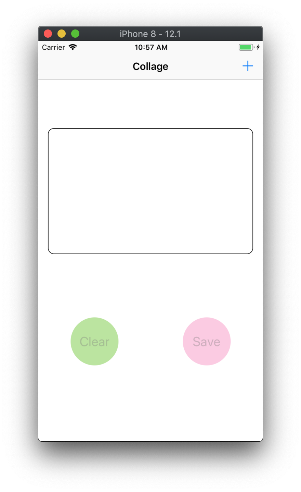
	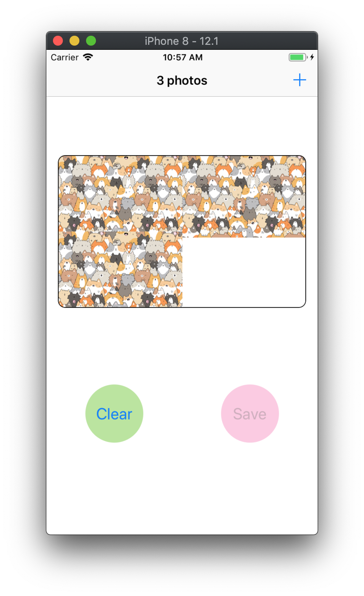
</center>

Tới đây thì chúng ta đã có thể thấy lợi ích của RxSwift rồi, với vài dòng code đơn giản mà chúng ta có thế điều khiển toàn bộ UI của app.

### Talking to other view controllers via subjects

Trong phần này ta sẽ kết nối class `PhotosViewController` đến `MainViewController` để lấy những photo được user chọn từ Camera Roll.

Đầu tiên, chúng ta cần push `PhotosViewController` vào navigation stack. Mở file `MainViewController.swift` tìm đến function `actionAdd()` và xoá hết code cũ ở đó đi và thay thế bằng:

```swift
    @IBAction func actionAdd() {
        guard let viewController = storyboard!.instantiateViewController(withIdentifier: "PhotosViewController") as? PhotosViewController else { return }
        navigationController?.pushViewController(viewController, animated: true)
    }
```

Chạy app và tap vào button `+` để tới Camera Roll. Lần đầu tiên khi chúng ta làm vậy, chúng ta cần cấp quyền access vào Photo Library:

<center>
	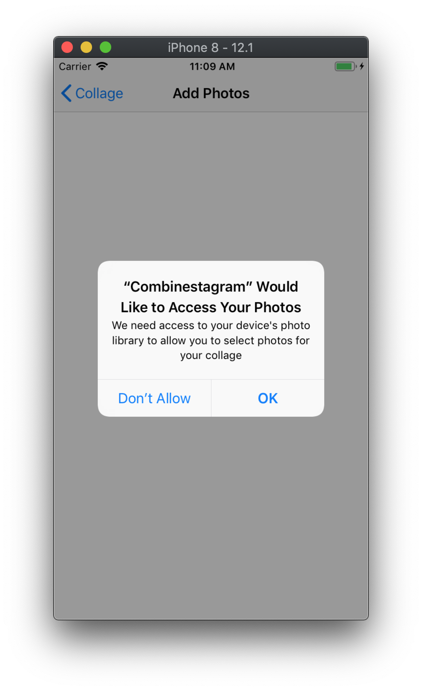
</center>

Sau khi tap OK, chúng ta sẽ thấy photo controller như bên dưới. Có thể có sự khác biệt giữa device và simulator, nên chúng ta cần back và thử lại sau khi cấp phép truy cập photo. Lần thứ hai, chúng ta nhất định sẽ thấy được các sample photo trên Simulator.

<center>
	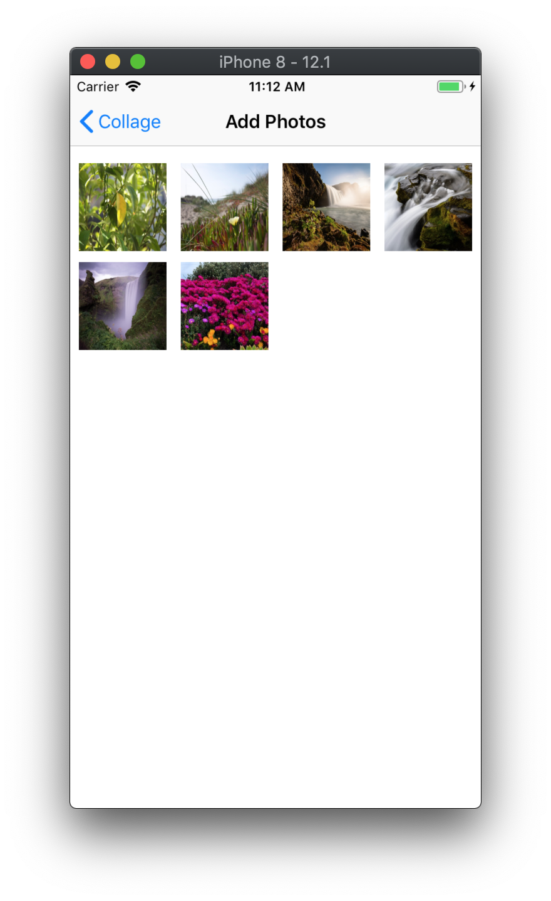
</center>

Nếu như chúng ta build app sử dụng Cocoa pattern, bước tiếp theo chúng ta sẽ add delegate protocol để photo view controller có thể giao tiếp ngược lại với main view controller, và đó là cách implement theo hướng non-reactive:

<center>
	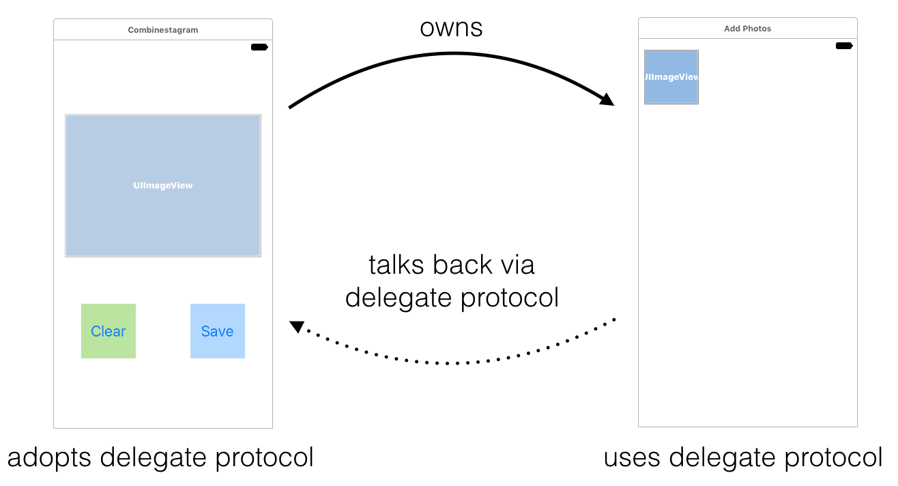
</center>

Tuy nhiên, đối với RxSwift thì không như vậy, chúng ta có một cách universal hơn giúp hai class giao tiếp với nhau - đó là observable. Chúng ta không cần phải định nghĩa protocol bởi observable có thể chuyển nhiều kiểu message đến một hoặc nhiều observer khác nhau.

#### Creating an observable out of the selected photos

Bước tiếp theo, chúng ta add subject vào `PhotosViewController`, subject đó có nhiệm vụ phát event `.next` mỗi khi user tap vào một ảnh trong Camera Roll. Mở file `PhotosViewController.swift` và thêm dòng code sau lên phía đầu:

```swift
import RxSwift
```

Chúng ta cần add một `PublishSubject` để lấy các ảnh được chọn, nhưng chúng ta sẽ không public access nó, bởi vì làm như vậy sẽ khiến các class khác có thể gọi `onNext(_)`, buộc subject phải phát ra value. Có thể trong trường hợp khác chúng ta cần phải làm như vậy, nhưng đối với trường hợp này thì không.

Thêm các property vào `PhotosViewController`:

```swift
    private let selectedPhotosSubject = PublishSubject<UIImage>()
    var selectedPhotos: Observable<UIImage> {
        return selectedPhotosSubject.asObservable()
    }
```

Ở đây chúng ta khai báo private đối với property `selectedPhotosSubject` (`PublishSubject` phát ra các photo được chọn) và public với property `selectedPhotos` (chỉ lấy các tính chất của observable từ subject). Subscribe đến `selectedPhotos` là cách mà main view controller lắng nghe photo sequence mà không gặp trở ngại nào.

`PhotosViewController` đã chứa code đọc ảnh từ Camera Roll và hiển thị nó lên collection view. Tất cả những gì chúng ta cần làm là thêm đoạn code phát ra những ảnh được chọn khi người dùng tap lên collection view cell.

Trong function `collectionView(_:didSelectItemAt:)`, code có sẵn đã giúp chúng ta lấy được ảnh user đang chọn. Việc chúng ta cần làm là trong closure `imageManager.requestImage(...)` là phát `.next` event. Add đoạn code sau phía trong closure, sau dòng lệnh `guard`:

```swift
if let isThumbnail = info[PHImageResultIsDegradedKey as NSString] as? Bool,
                !isThumbnail {
    self?.selectedPhotosSubject.onNext(image)
}
```

Vậy là từ giờ chúng ta không cần phải xài delegate protocol nữa vì mối quan hệ giữa các view controller đã trở nên đơn giản hơn nhiều:

<center>
	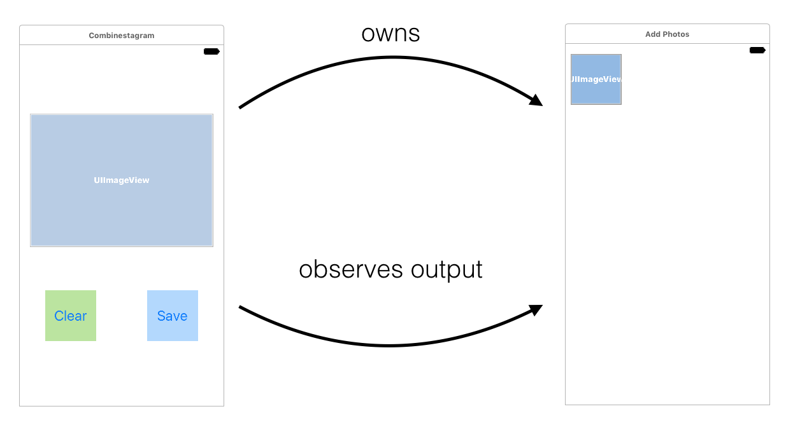
</center>

#### Observing the sequence of selected photos

Nhiệm vụ tiếp theo là trở về `MainViewController.swift`, thêm đoạn code lắng nghe photo sequence.

Tìm tới function `actionAdd()` thêm đoạn code sau ngay trước đoạn code push new view controller vào navigation stack:

```swift
viewController.selectedPhotos
    .subscribe(
        onNext: { [weak self] newImage in
        },
        onDisposed: {
            print("Completed photo selection")
    }).disposed(by: disposeBag)
```

Trước khi push view controller, chúng ta subscribe event từ property `selectedPhoto` của nó. Cần quan tâm tới hai event là `.next` (khi user tap vào một ảnh) và khi subscription bị dispose.

Thêm đoạn code vào closure `.onNext`:

```swift
guard let this = self else { return }
this.images.value.append(newImage)
```

Chạy app và kiểm tra thành quả nào. Cool! ❄️

<center>
	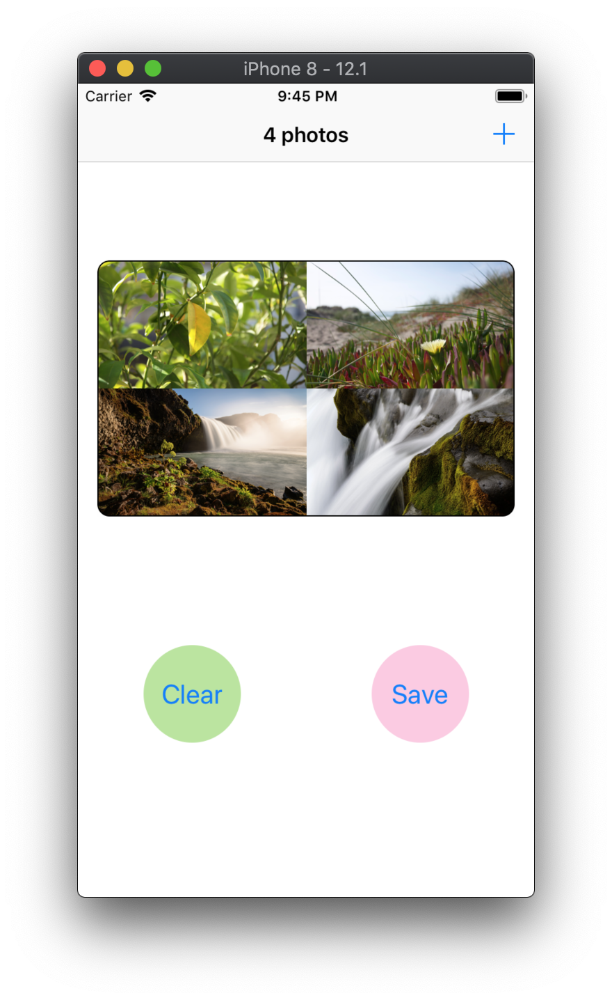
</center>

#### Disposing subscriptions - review

Tới đoạn này thì code đã hoạt động đúng mong đợi rồi, nhưng mà bạn thử các bước sau đi: thêm một vài hình vào collage rồi quay lại main screen và kiểm tra console. Bạn không thấy dòng "Completed photo selection" được in ra. Vậy có nghĩa là dòng lệnh `print` trong `onDispose` closure lúc này không bao giờ được gọi tới, tương đương với việc subscription không bao giờ bị dispose và không giải phóng memory! 💥

Chúng ta đã subscribe observable sequence rồi vất nó cho dispose bag của main screen. Subscription này sẽ bị dispose chỉ khi bag object bị release, hoặc là sequence kết thúc bởi error hoặc completed event.

Bởi vì main screen không bị release và photo sequence cũng không bị kết thúc, vậy nên subscription này cứ trường tồn như vậy.

Vậy nên tốt nhất là trước khi back về main screen từ photo view controller, ta nên phát `.completed` event để cho tất cả các observer của nó được hoàn thành và dispose.

Mở file `PhotosViewController.swift`, phát `.completed` event cho subject trong function `viewWillDisappear(_:)`:

```swift
selectedPhotosSubject.onCompleted()
```

Perfect! ✅

### Creating a custom observable

Để wrap up phần này, ta sẽ tạo một Observable custom và chuyển Apple API cơ bản thành một reactive class. Ta sẽ xài Photos framework để lưu photo collage in reactive way!

Ta sẽ tạo một class mới tên PhotoWriter hay vì viết reactive extension cho PHPhotoLibrary:

<center>
	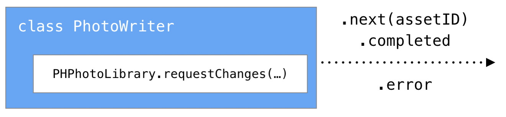
</center>

Nếu image được lưu lại thành công thì ta sẽ phát asset ID và và `.complete` event, nếu không thì phát ra `.error` event.

#### Wrapping an existing API

Mở `PhotoWriter.swift`, import RxSwift:

```swift
import RxSwift
```

Thêm mới static method sau vào `PhotoWriter`, có nhiệm vụ tạo ra một observable thông báo ta muốn lưu photo:

```swift
    static func save(_ image: UIImage) -> Observable<String> {
        return Observable.create({ observer in
        })
    }
```

`save(_:)` sẽ trả về một `Observable<String>`, bởi sau khi lưu lại photo, ta sẽ phát ra một element chứa local identifier của asset mà ta vừa tạo.

`Observable.create(_)` sẽ tạo `Observable` mới, điều ta cần làm là thêm một vài xử lý vào đoạn closure sau cùng. Thêm đoạn code sau vào closure của `Observable.create(_)`:

```swift
var savedAssetId: String?
PHPhotoLibrary.shared().performChanges({
// first closure
}, completionHandler: { success, error in
// second closure
})
```

Trong first closure, tạo ra một photo asset mới bằng cách sử dụng `PHAssetChangeRequest.creationRequestForAsset(from:)` và lưu identifier của nó trong `savedAssetId`:

```swift
let request = PHAssetChangeRequest.creationRequestForAsset(from: image)
savedAssetId = request.placeholderForCreatedAsset?.localIdentifier
```

Ở second closure `completionHandler`, nếu ta nhận success response và `savedAssetId` not null, ta sẽ phát `.next` và `.completed` event. Trong trường hợp ngược lại, chúng ta sẽ phát custom error hoặc một default error nào đó:

```swift
DispatchQueue.main.async {
    if success, let id = savedAssetId {
        observer.onNext(id)
        observer.onCompleted()
    } else {
        observer.onError(Errors.couldNotSavePhoto)
    }
}
```

Tới đây thì phần logic đã hoàn thành. Tuy nhiên ta phải return `Disposable` ở ngoài closure. Thêm dòng code sau:

```swift
return Disposables.create()
```

Đoạn code hoàn thành sẽ như sau:

```swift
static func save(_ image: UIImage) -> Observable<String> {
    return Observable.create({ observer in
        var savedAssetId: String?
        PHPhotoLibrary.shared().performChanges({
            let request = PHAssetChangeRequest.creationRequestForAsset(from: image)
            savedAssetId = request.placeholderForCreatedAsset?.localIdentifier
        }, completionHandler: { success, error in
            DispatchQueue.main.async {
                if success, let id = savedAssetId {
                    observer.onNext(id)
                    observer.onCompleted()
                } else {
                    observer.onError(Errors.couldNotSavePhoto)
                }
            }
        })
        return Disposables.create()
    })
}
```

Ôn lại một tý kiến thức ở [chapter trước][Chapter 3]. Chúng ta có thể tạo ra một `Observable` bằng một trong những cách sau:

- Observable.never(): Tạo observable sequences không bao giờ phát ra element nào.
- Observable.just(_:): Phát ra một element và một `.completed` event.
- Observable.empty(): Không phát ra element  followed by a .completed event.

Như vậy, observable có thể cung cấp bất kỳ loại event nào, từ event không phát tới phát nhiều `.next` element, có thể terminate được bởi sự kiện `.completed` hay là `.error`.

Đối với trường hợp của PhotoWriter, chúng ta chỉ cần quan tâm một event duy nhất. Vậy nên tác vụ save chỉ cần hoàn thành một lần duy nhất. Chúng ta sẽ dùng `.next` kết hợp với `.completed` event cho trường hợp lưu thành công; và `.error` cho trường hợp lưu thất bại.

Có thể trong phần trước, bạn đã đặt câu hỏi `Single` dùng để làm gì. Thì giờ bạn đã có câu trả lời rồi đấy.

### RxSwift traits in practice

Ở [Chapter 2][Chapter 2] Observables chúng ta đã tìm hiểu một chút về RxSwift trait được sử dụng trong một số trường hợp cụ thể.

Trong chapter này, chúng ta sẽ lướt sơ lại và ứng dụng một số traits trong project `Combinestagram`. Hãy bắt đầu với `Single`.

#### Single

Ở trong Chapter 2, Single được giới thiệu là một Observable đặc biệt. Nó chỉ phát duy nhất một sự kiện `.success(Value)` hoặc là một `.error`, được mô tả ngay bên dưới.

<center>
	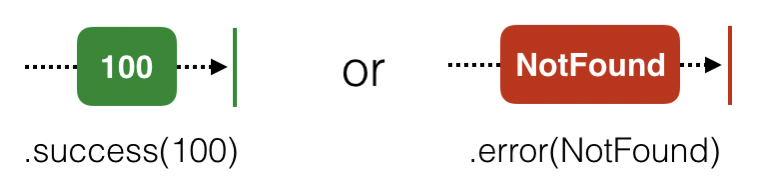
</center>

Loại trait này hữu ích trong một số tình huống khi lưu file, download file, load file từ disk, hoặc bất cứ tác vụ bất đồng bộ nào trả về một value nào đấy. Chúng ta có thể phân loại thành 2 use case của `Single`:

1. Để đóng gói các tác vụ cần phát duy nhất một element khi thành công, giống như tác vụ `PhotoWriter.save(_)` được nhắc tới phía trên. Chúng ta có thể trực tiếp tạo ra một `Single` thay vì `Observable`. Thực tế là chúng ta sẽ thay đổi `save(_)` method trong `PhotoWriter` tạo ra `Single` trong phần chapter challenge.
2. Để diễn tả một cách tốt hơn cái ý định sử dụng duy nhất một element của observable sequence và để chắc chắn rằng nếu như sequence đó phát ra nhiều hơn một element thì các subcription của nó sẽ nhận error. Để đạt được điều này, chúng ta có thể subcribe bất cứ một observable nào và sử dụng hàm `.asSingle()` để convert ra `Single`.

#### Maybe

`Maybe` khá giống với `Single`, điểm duy nhất khác biệt là observable này có thể không phát ra value khi completion thành công.

<center>
	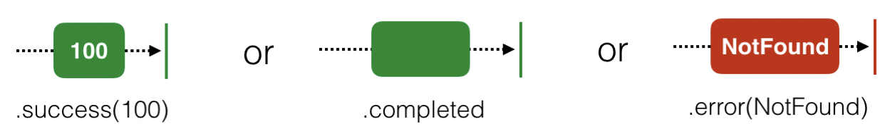
</center>

Nếu đưa vào ví dụ về photograph, hãy tưởng tượng trong trường hợp của use case `Maybe`, app của chúng ta đang lưu lại các photos vào photo album. Chúng ta cố gắng sử dụng album identifier trong UserDefaults và sử dụng ID đó để mở album ra và lưu photo vào trỏng. Chúng ta sẽ phải thiết kế method `open(albumId:) -> Maybe<String>` để handle các trường hợp sau:

1. Trong trường hợp album với ID đó tồn tại, phát ra `.completed` evebt
2. Trong trường hợp người dùng đã delete album đó rồi, tạo một album mới và phát `.next` event với value là ID mới và lưu nó lại vào UserDefaults.
3. Trong trường hợp nó bị lỗi ở đâu đó làm chúng ta không thể truy cập vào album được, phát `.error` event.

Cũng giống như các traits khác, chúng ta vẫn có thể đạt được chức năng tương tự khi sử dụng `Observable`, tuy nhiên `Maybe` cung cấp ngữ cảnh cụ thể, dễ hiểu hơn cho chúng ta lẫn các developer khác khi đọc code sau này.

Cũng tương tự như `Single`, chúng ta có thể tạo ra `Maybe` bằng cách sử dụng `Maybe.create({ ... })` hoặc `.asMaybe()`.	

#### Completable

Trait cuối cùng mình muốn nhắc đến là `Completable`, nó cho phép duy nhất `.completed` hoặc `.error` event được phát ra trước khi subcription bị dispose.

<center>
	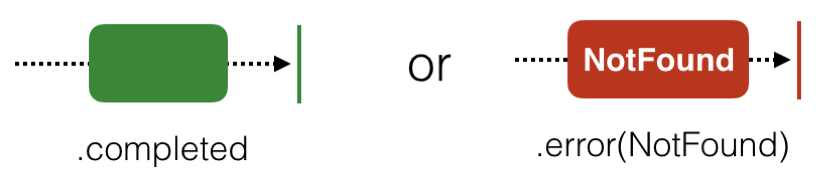
</center>

Cần lưu ý, chúng ta không thể convert obserable sequence thành completable. Bởi vì các tác vụ của observable luôn cho phép phát ra value, chúng ta không thể nào convert qua lại giữa hai loại này.

Chúng ta chỉ có thể tạo ra completable sequence bằng `Completable.create({ ... })`.

`Completable` được sử dụng chỉ khi bạn cần biết một tác vụ đồng bộ đã thành công hay thất bại.

Ví dụ: Chúng ta có một app có tính năng auto-save document khi người dùng đang làm việc với nó. Chúng ta muốn lưu document một cách bất đồng bộ ở background queue và khi nào nó hoàn thành, chúng ta sẽ show một notification nho nhỏ hoặc alert box ngay trên màn hình nếu tác vụ fail.

Chúng ta sẽ implement bằng cách viết saving logic vào function `aveDocument() -> Completable`. Và đoạn code dưới đây sẽ giải quyết logic còn lại.

```swift
saveDocument()
    .andThen(Observable.from(createMessage))
    .subscribe(onNext: { message in
        message.display()
    }, onError: {e in
        alert(e.localizedDescription)
    })
```

`andThen` cho phép chúng ta có thể móc nối nhiều completables hoặc observables khi chúng phát ra `.success` event và subcribe final result. Trong trường hợp một trong số chúng phát ra error, code sẽ fall through `onError` closure.

#### Subscribing to the custom observable

Feature lưu photo vào Photos library sẽ rơi vào một trong số những trường hợp đặc biệt sử dụng trait. Observable `PhotoWriter.save(_)` sẽ chỉ phát một lần (new asset ID) hoặc là error, cho nên chúng ta sẽ xài `Single` cho trường hợp này.

Mở `MainViewController.swift` add đoạn code này vào `actionSave()` cho Save button:

```swift
    @IBAction func actionSave() {
        guard let image = imagePreview.image else { return }
        PhotoWriter.save(image)
            .asSingle()
            .subscribe(onSuccess: { [weak self] id in
                self?.showMessage("Saved with id: \(id)")
                self?.actionClear()
                }, onError: { [weak self] error in
                    self?.showMessage("Error", description: error.localizedDescription)
            })
            .disposed(by: disposeBag)
    }
```

Đoạn code trên mô tả chúng ta đang gọi `PhotoWriter.save(image)` để lưu bộ sưu tập hiện tại. Sau đó chúng ta convert `Observable` thành `Single`, để đảm bảo rằng subcription sẽ chỉ nhật duy nhất một element, và hiển thị một message cho biết tác vụ hoàn thành thành công hay thất bại. Thêm vào đó chúng ta clear bộ sưu tập hiện tại nếu tác vụ lưu thành công.

> *Note:* `asSingle()` sẽ đảm bảo rằng chúng ta chỉ nhận được duy nhất một element bằng cách throw error nếu sequence phát nhiều hơn một element.

Chạy app nào và vào Photos để check kết quả nhé!

<center>
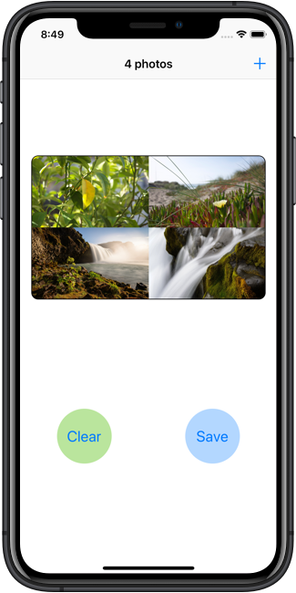

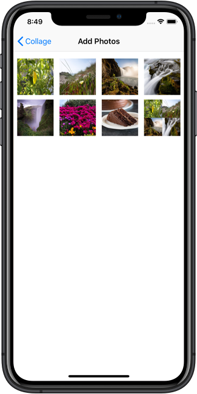
</center>

### Challenge

#### Challenge 1

```swift
// PhotoWriter.swift
static func save(_ image: UIImage) -> Single<String> {
    return Single.create { single -> Disposable in
        var savedAssetId: String?
        PHPhotoLibrary.shared().performChanges({
            let request = PHAssetChangeRequest.creationRequestForAsset(from: image)
            savedAssetId = request.placeholderForCreatedAsset?.localIdentifier
        }, completionHandler: { success, error in
            DispatchQueue.main.async {
                if success, let id = savedAssetId {
                    single(.success(id))
                } else {
                    single(.error(Errors.couldNotSavePhoto))
                }
            }
        })
        return Disposables.create()
    }
}
```

#### Challenge 2

```swift
// UIViewControllerExt.swift
extension UIViewController {
    func alert(title: String = "",
               message: String = "") -> Completable {
        return Completable.create { [weak self] completable in
            guard let this = self else {
                completable(.completed)
                return Disposables.create()
            }
            let alert = UIAlertController(title: title,
                                          message: message,
                                          preferredStyle: .alert)
            let action = UIAlertAction(title: "Close", style: .default) { _ in
                alert.dismiss(animated: true, completion: nil)
                completable(.completed)
            }
            alert.addAction(action)
            this.present(alert, animated: true, completion: nil)
            return Disposables.create()
        }
    }
}
```

hoặc:

```swift
func alert(title: String = "",
           message: String = "") -> Observable<Bool> {
    return Observable.create { [weak self] observable in
        guard let this = self else {
            observable.onCompleted()
            return Disposables.create()
        }
        let alert = UIAlertController(title: title,
                                      message: message,
                                      preferredStyle: .alert)
        let action = UIAlertAction(title: "Close", style: .default) { _ in
            alert.dismiss(animated: true, completion: nil)
            observable.onCompleted()
        }
        alert.addAction(action)
        this.present(alert, animated: true, completion: nil)
        return Disposables.create()
    }
}
```


## More

Quay lại chapter trước [Chapter 3: Subjects][Chapter 3]

Đi đến chapter sau [Chapter 5: Filtering operators][Chapter 5]

Quay lại [RxSwiftDiary's Menu][Diary]

## Reference

[RxSwift: Reactive Programming with Swift][Reference] 

---
[Chapter 3]: ./Section1-Chapter3.md "Subjects"
[Chapter 5]: ./Section2-Chapter5.md "Filtering operators"
[Diary]: https://github.com/nmint8m/rxswiftdiary "RxSwift Diary"
[Reference]: https://store.raywenderlich.com/products/rxswift "RxSwift: Reactive Programming with Swift"
