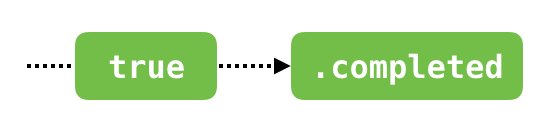

#  Section II: Operators and Best Practices

- Operator là những building block của Rx, được sử dụng để chuyển đổi, xử lý và phản hồi lại các event được phát ra bởi các observanles.
- Tương tự như việc kết hợp +-*/ để tạo ra một phép toán phức tạp, ta có thể kết nối (chain) và biên soạn các operator đơn giản của Rx thành một logic app phức tạp.
- Filtering operators: Cho phép xử lý một số event nhưng bỏ qua một số khác.
- Transforming operators: Tạo ra và xử lý các tác vụ phức tạp liên quan đến chuyển đổi data.
- Time based operators: Hoãn event, nhóm event theo từng thời điểm.
- Kết hợp các operators với nhau.

**Nội dung:**

  - [Chapter 5: Filtering Operators](#Chapter-5-Filtering-Operators)
    - [Ignoring operators](#Ignoring-operators)
      - [ignoreElements()](#ignoreElements)
      - [elementAt(n)](#elementAtn)
      - [filter{condition}](#filtercondition)
    - [Skipping operators](#Skipping-operators)
      - [skip(n)](#skipn)
      - [skipWhile{condition}](#skipWhilecondition)
      - [skipUntill(observable)](#skipUntillobservable)
    - [Taking operators](#Taking-operators)
      - [take(n)](#taken)
      - [takeWhile{condition}](#takeWhilecondition)
      - [takeUntil(observable)](#takeUntilobservable)
    - [Distinct operators](#Distinct-operators)
      - [distinctUntilChanged()](#distinctUntilChanged)
    - [Challenges](#Challenges)

<br>

  - [Chapter 6: Filtering Operators in Practice](#Chapter-6-Filtering-Operators-in-Practice)
    - [Improving the Combinestagram project](#Improving-the-Combinestagram-project)
    - [Sharing subscriptions](#Sharing-subscriptions)
      - [Ignoring all elements](#Ignoring-all-elements)
      - [Filtering elements you donʼt need](#Filtering-elements-you-don%CA%BCt-need)
      - [Implementing a basic uniqueness filter](#Implementing-a-basic-uniqueness-filter)
      - [Keep taking elements while a condition is met](#Keep-taking-elements-while-a-condition-is-met)
    - [Improving the photo selector](#Improving-the-photo-selector)
      - [PHPhotoLibrary authorization observable](#PHPhotoLibrary-authorization-observable)
      - [Reload the photos collection when access is granted](#Reload-the-photos-collection-when-access-is-granted)
      - [Display an error message if the user doesnʼt grant access](#Display-an-error-message-if-the-user-doesn%CA%BCt-grant-access)
    - [Trying out time based filter operators](#Trying-out-time-based-filter-operators)
      - [Completing a subscription after given time interval](#Completing-a-subscription-after-given-time-interval)
      - [Using throttle to reduce work on subscriptions with high load](#Using-throttle-to-reduce-work-on-subscriptions-with-high-load)
    - [Challenge](#Challenge)
  - [More](#More)
  - [Reference](#Reference)

<br>

##  Chapter 5: Filtering Operators

Sử dụng filtering operators để giới hạn `.next` event, để các subscriber chỉ nhận những elements cần thiết đối với chúng.

### Ignoring operators

#### ignoreElements()

- Bỏ qua các `.next` event.
- Cho các stop event qua như: `.completed` hoặc `.error`.

<center>
    
</center>

- Ví dụ:

```swift
let strikes = PublishSubject<String>()
let disposeBag = DisposeBag()

strikes
    .ignoreElements()
    .subscribe { _ in
      print("You're out!")
    }
    .disposed(by: disposeBag)

strikes.onNext("X")
strikes.onNext("X")
strikes.onNext("X")
strikes.onCompleted()
```

- Kết qủa:

```
You're out! // In ra khi .onCompleted() được gọi
```

#### elementAt(n)

- Sử dụng khi bạn chỉ muốn xử lý tác vụ tại element thứ n được phát

<center>
    
</center>

#### filter{condition}

- Sử dụng một closure để quyết định, áp dụng cho tất cả các element, chỉ cho phép các element được quyết định true đi qua.

<center>
    
</center>

### Skipping operators

#### skip(n)

- Bỏ qua n element đầu.

<center>
    
</center>

#### skipWhile{condition}

- Sử dụng một closure để quyết định, cho đến khi nào điều kiện quyết định bằng false thì sẽ cho tất cả các element sau đi qua, những element trở về trước đều được bỏ qua.

<center>
    
</center>

#### skipUntill(observable)

- Filter được nhắc tới trong phần trên được dựa trên một điều kiện cố định. Nếu như ta cần phải filter dựa trên observabke khác thì ở đây có một số operator có thể xử lý được điều đó.
- `skipUntil` sẽ bỏ qua các element từ source observable cho đến khi một trong số những trigger observable phát ra.

<center>
    
</center>

- Ví dụ: 

```swift
let disposeBag = DisposeBag()
let subject = PublishSubject<String>()
let trigger = PublishSubject<String>()

subject
    .skipUntil(trigger)
    .subscribe(onNext: { print($0) })
    .disposed(by: disposeBag)

subject.onNext("A")
subject.onNext("B")
trigger.onNext("X")
subject.onNext("C")
```

- Kết quả:

```
C
```

### Taking operators

- Trái ngược với skip.

#### take(n)

- Lấy n element.

<center>
    
</center>

#### takeWhile{condition}

<center>
    
</center>

- Khi ta cần trỏ tới vị trí thứ tự của element được phát ra, sử dụng `enumerated` operator trong Swift Standard Library. Nó sẽ trả về một tuple gồm index và element của mỗi element đã được phát ra.

```swift
let disposeBag = DisposeBag()

Observable.of(2, 2, 4, 4, 6, 6)
    .enumerated()
    .takeWhile { index, integer in
      integer % 2 == 0 && index < 3
    }
    .map { $0.element }
    .subscribe(onNext: { print($0) })
    .disposed(by: disposeBag)
```

```
2
2
4
```

#### takeUntil(observable)

- Tương tự `skipUntil`, `takeUntil` sẽ lấy các element từ source observable cho đến khi một trong số những trigger observable phát ra.

<center>
    
</center>

- Ví dụ:

```
let disposeBag = DisposeBag()

let subject = PublishSubject<String>()
let trigger = PublishSubject<String>()

subject
    .takeUntil(trigger)
    .subscribe(onNext: { print($0) })
    .disposed(by: disposeBag)

subject.onNext("1")
subject.onNext("2")
trigger.onNext("X")
subject.onNext("3")
}
```

- Kết quả:

```
1
2
```

- `takeUntil` có thể được sử dụng để dispose một subscription thay vì add vào dispose bag. Ví dụ:

```
someObservable
    .takeUntil(self.rx.deallocated)
    .subscribe(onNext: { print($0) })
```

### Distinct operators

- Các operators này giúp giảm tải các item giống nhau được đi qua.

#### distinctUntilChanged()

- Bỏ qua các item trùng nhau liên tiếp.
- Sử dụng `distinctUntilChanged` sử dụng `Equatable`:

<center>
    
</center>

```swift
let disposeBag = DisposeBag()

Observable.of("A", "A", "B", "B", "A")
  .distinctUntilChanged()
  .subscribe(onNext: { print($0) })
  .disposed(by: disposeBag)
```

- Hoặc custom `distinctUntilChanged`:

```swift
let disposeBag = DisposeBag()
let formatter = NumberFormatter()
formatter.numberStyle = .spellOut
let space = " "

Observable<NSNumber>.of(10, 110, 20, 200, 210, 310)
    .distinctUntilChanged { a, b in
        guard let aWords = formatter.string(from: a)?.components(separatedBy: space),
        let bWords = formatter.string(from: b)?.components(separatedBy: space) else {
            return false
        }
        var containsMatch = false
        for aWord in aWords {
            for bWord in bWords {
                if aWord == bWord {
                    containsMatch = true
                    break
                }
            }
        }
        return containsMatch
    }.subscribe(onNext: { print($0) })
    .disposed(by: disposeBag)
}
```

### Challenges

```swift
    input
        .asObservable()
        .skipWhile { number -> Bool in
            return number == 0
        }.filter { number -> Bool in
            return number >= 0 && number < 10
        }.take(10)
        .toArray()
        .subscribe(onNext: {
            let phone = phoneNumber(from: $0)
            if let contact = contacts[phone] {
                print("Dialing \(contact) (\(phone))...")
            } else {
                print("Contact not found")
            }
        }).disposed(by: disposeBag)
```

<br>
<br>

##  Chapter 6: Filtering Operators in Practice

### Improving the Combinestagram project

Quay lại với Combinestagram project, ta sẽ tiếp tục nâng cấp nó cùng với kiến thức trong Chapter 5.

- Khi xài dần app hiện tại, ta sẽ phát hiện ra có nhiều việc cần làm để cải thiện:
  - Mỗi lần photos observable completes, user sẽ quay lại màn hình chính; vài thứ sẽ được bật/tắt đi, label cần được update, v.v.
  - Tiếp theo đây ta sẽ đi vào phần làm sao để làm nhiều việc khi sử dựng cùng một subscription tới một observable instance.


### Sharing subscriptions

- Có nhiều vấn đề khi gọi `subscribe(...)` của một observable nhiều lần. Ví dụ như sau: 
  - Nếu như duplicate đoạn subscription nhiều lần, thì kết quả sẽ thu được trong trường hợp này khá khó chịu.
  - Vấn đề ở đây là mỗi khi gọi `subscribe(...)` sẽ tạo ra một **observable mới** cho mỗi subscription đó, mỗi phiên bản copy này không đảm bảo sẽ giống y hệt cái trước, và thậm chí cả khi observable phát y hệt sequence chăng nữa thì việc đó cũng không cần thiết. 


```swift
var start = 0
func getStartNumber() -> Int {
start += 1
    return start
}

let numbers = Observable<Int>.create { observer in
    let start = getStartNumber()
    observer.onNext(start)
    observer.onNext(start+1)
    observer.onNext(start+2)
    observer.onCompleted()
    return Disposables.create()
}

// Subscription
numbers
  .subscribe(onNext: { el in
    print("element [\(el)]")
  }, onCompleted: {
    print("-------------")
  })
```

```
element [1]
element [2]
element [3]
-------------
element [2]
element [3]
element [4]
-------------
```

- Sử dụng `share()` operator: tạo ra nhiều sequences từ **cùng một observable**.

- Thay vì tạo mới nhiều observable:

<center>
    
</center>

- Thạo một observable và sử dụng `share()` operator:

<center>
    
</center>

- Vào `MainViewController.swift` hàm `addAction()`, thay thế dòng `viewController.selectedPhotos` bằng:

```swift
let shareSelectedPhotos = viewController.selectedPhotos.share()
// Tiếp tục với shareSelectedPhotos.subscribe(...)
```

> Note:
> - `share()` không cung cấp cho subscription những value được phát ra trước khi subscription hoạt động. does not provide any of the subscriptions with values emitted before the subscription takes effect. 
> - `share(replay:scope:)` giúp giữ buffer một số value được phát ra trước đó và cung cấp cho subscription mới.

####  Ignoring all elements

- Mỗi khi user chọn một photo, `shareSelectedPhotos` sẽ phát một `UIImage` element.
- Việc cần làm:
  - Thêm một phần preview vào góc trên bên trái - một navigation icon.
  - Bởi ta cần update icon một lần duy nhất khi user quay lại main view controller, nên phải ignore tất cả `UIImage` element và hoạt động chỉ khi có `.completed` event.
  - `ignoreElements()` bỏ qua `.next`, nhận `.completed` và `.error`.
- Vào `MainViewController.swift` dưới hàm `addAction()` và add thêm subscription thứ hai dưới subscription vừa được add ở phía trên:

```swift
shareSelectedPhotos
    .ignoreElements()
    .subscribe(onCompleted: { [weak self] in
        guard let this = self else { return }
        this.updateNavigationIcon()
    }).disposed(by: viewController.bag)
```

- Trong đó:

```swift
private func updateNavigationIcon() {
    let icon = imagePreview.image?
        .scaled(CGSize(width: 22, height: 22))
        .withRenderingMode(.alwaysOriginal)
    navigationItem.leftBarButtonItem = UIBarButtonItem(image: icon, style: .done, target: nil, action: nil)
}
```

- Run app:

<center>
    
</center>

#### Filtering elements you donʼt need

- Sử dụng `filter{condition}` để lọc những element cần thiết.
- Ví dụ như các ảnh dọc không thích hợp đối với collage trong app Combinestagram cho lắm.
- Cần bỏ qua các ảnh dọc, lấy ảnh ngang trong trường hợp này.
- Vào `MainViewController.swift` dưới hàm `addAction()` và add vào subscription thứ nhất `filter{condition}` operatoror ngay trước `subsribe(...)`:

```swift
shareSelectedPhotos
    .filter { newImage in
        return newImage.size.width > newImage.size.height
    }.subscribe(...
```

#### Implementing a basic uniqueness filter

- Cần bỏ qua những ảnh trùng.
- Có cách giải quyết tốt hơn cho trường hợp này. Nhưng hãy xem cách xử lý với Rx thế nào đã.
- Vì:
  - Observable không cung cấp state hiện tại hay value history, nên để check element có phải là duy nhất hay không, ta cần phải tự track nó.
  - Không thể giữ index đối với các image được phát ra bởi vì cho dù là hai `UIImage` object cùng thể hiện một image thì chúng cùng không giống nhau.
  - Cần lưu trữ hash image data hoặc asset URL là cách tốt nhất.
  - Tuy nhiên đối với xử lý đơn giản hoá thì ta sẽ sử dụng độ dài byte của image mặc dù nó sẽ không đảm bảo tính duy nhất về index của image cho lắm.

- Thêm vào `MainViewController.swift`:

```swift
private var imageCache = [Int]()
```

- Vào `MainViewController.swift` dưới hàm `addAction()` và add vào subscription thứ nhất `filter{condition}` operatoror ngay sau filter được tạo ở phía trên:

```swift
shareSelectedPhotos
    .filter { ...
    }.filter { [weak self] newImage in
        guard let this = self else { return false }
        let imageLenght = UIImagePNGRepresentation(newImage)?.count ?? 0
        guard !this.imageCache.contains(imageLenght) else {
            return false
        }
        this.imageCache.append(imageLenght)
        return true
    }.subscribe( ...
```

> Note:
> - Ta vừa đi qua ví dụ của `state` với `imageCache`.
> - Ở chapter 9, ta sẽ tiếp cận với `scan` operator để xử lý các tình huống như thế này.

- Cuối cùng vào `actionClear()`, thêm:

```swift
imageCache = []
```

#### Keep taking elements while a condition is met

- Bug ở app hiện tại:
  - Ở main view controller, nút + sẽ được disabled nếu ta add đủ 6 ảnh.
  - Nhưng ở photos view controller, ta có thể add bao nhiêu image cũng được.
- Cần hạn chế điều trên lại.
- Vào `MainViewController.swift` dưới hàm `addAction()` và add vào subscription thứ nhất `takeWhile{condition}` trước `filter{condition}` trên cùng: 
  
```swift
shareSelectedPhotos
    .takeWhile{ [weak self] _ in
        guard let this = self else { return false }
        return this.images.value.count < 6
    }.filter { ...
```

### Improving the photo selector

- Cải thiện UX của PhotosViewController.

#### PHPhotoLibrary authorization observable

> Note: 
> - Reset simulator về trạng thái ban đầu: Mở iPhone simulator > Reset Content and Settings... > Reset. 
> - Xóa app Combinestagram và chạy lại.

- Tạo file `PHPhotoLibrary+rx.swift` rồi add:

```swift
import Foundation
import Photos
import RxSwift

extension PHPhotoLibrary {

    static var authorized: Observable<Bool> {
        return Observable.create { observer in
            return Disposables.create()
        }
    }
}
```

- Observable `authorized` có thể hoạt động theo 2 cách như sau:

<center>
    
</center>

- Implement logic trên bằng cách thêm đoạn sau vào closure của `create` và ngay trên `return Disposables.create()`:

```swift
DispatchQueue.main.async {
    if authorizationStatus() == .authorized {
        observer.onNext(true)
        observer.onCompleted()
    } else {
        observer.onNext(false)
        requestAuthorization { status in
            observer.onNext(status == .authorized)
            observer.onCompleted()
        }
    }
}
```

#### Reload the photos collection when access is granted

- Có 2 kịch bản khi vào library như sau:

|| Senario 1 |
|---|---|
| Lần đầu tiên mở library của app, user tap vào | `OK` |
| Marble diagram |  |
| Những lần sau khi đã cấp phép |  |

- Việc tiếp thao cần làm là:
  - Subscribe `PHPhotoLibrary.authorized`.
  - `true` có thể là element cuối cùng của sequence, vậy nên khi nhận `true` element, cần reload collection và hiển thị Camera Roll.
- Mở `PhotosViewController.swift`, trong `viewDidLoad()` thêm:

```swift
let authorize = PHPhotoLibrary.authorized.share()
authorize
    .skipWhile { return !$0 }
    .take(1).subscribe(onNext: { [weak self] _ in
        guard let this = self else { return }
        DispatchQueue.main.async {
            this.photos = PhotosViewController.loadPhotos()
            this.collectionView?.reloadData()
        }
    }).disposed(by: bag)
```

- Trong đoạn code trên:
  - Bỏ qua tất cả các `false` element. Trong trường hợp user không cấp quyền truy cập, `.onNext` sẽ không bao giờ đượ cchajy.
  - Tiếp theo khi `true` được phát ra lần đầu, ta lấy element đó và ignore những giá trị sau đó.  
  - Cần chuyểnn về main thread trước khi reload collection view vì không đảm bảo được nó được chạy trên thread nào, nếu nó ở background thì app sẽ crash. Khi update UI cần ở trên main thread.

<center>
    
</center>

#### Display an error message if the user doesnʼt grant access

- Kịch bản thứ 2, khi người dùng từ chối cấp quyền access vào photo library:

|| Senario 2 |
|---|---|
| Lần đầu tiên mở library của app, user tap vào | `Cancel` |
| Marble diagram |  |
| Những lần sau khi đã cấp phép |  |

- Hai sequence trên có kết quả giống nhau vì nó cùng một code path. Có thể thấy thông qua 2 sequence trên:
  - Ta luôn có thể bỏ qua element thứ nhất của sequence, vì nó không bao giờ quyết định kết quả cuối cùng.
  - Cần check element cuối của sequence, nếu nó là `false` thì show error message.
- Thêm đoạn sau vào `viewDidLoad()`:

```swift
authorize
    .skip(1)
    .takeLast(1)
    .filter { return !$0 }
    .subscribe(onNext: { [weak self] _ in
        guard let this = self else { return }
        DispatchQueue.main.async {
            this.errorMessage()
        }
        }
    ).disposed(by: bag)
```

- Xoá app rồi chạy app từ đầu:

| Vào photo library | Cho phép access | Đổi quyền access | Vào photo library lại |
|---|---|---|---|
|  |  |  |  |

### Trying out time based filter operators

- Đọc kỹ hơn về time-based operator tại [Chapter 11][Chapter 11]. Ở đây chỉ đưa ra một ví dụ nhỏ về chúng.
- Time-based operator sử dụng `Scheduler` và `Scheduler` là một concept khá quan trọng ở đây.

#### Completing a subscription after given time interval

- Ở ví dụ trên, khi user trước đó đã từ chối cấp phép truy cập vàoo photo library, thì user sẽ thấy alert box hiện ra và họ cần nhấn `Close` để quay lại.
- Ở phần này ta sẽ thay đổi code, để chỉ phải show alert box trong vòng 5 giây, nếu user không bấm `Close` trong thời gian hạn định, alert box sẽ tự động biến mất.
- Vào `PhotosViewController.swift` hàm `errorMessage()`, thêm dòng code ngay sau hàm `alert(title:description:)`

```swift
.take(5, scheduler: MainScheduler.instance)
.subscribe(...)
```

#### Using throttle to reduce work on subscriptions with high load

- Có lúc ta chỉ cần quan tâm đến các element của sequence hiện tại.
- Vào `MainViewController.swift`, hàm `viewDidLoad()`:

```swift
images.asObservable()
    .throttle(0.5, scheduler: MainScheduler.instance)
    .subscribe(onNext: { [unowned self] photos in
        self.imagePreview.image = UIImage.collage(images: photos,
                                                  size: self.imagePreview.frame.size)
    })
    .disposed(by: disposeBag)
```

- Mỗi lần user chọn một photo, subscription lại nhận một photo collection mới và tạo ra collage. Nếu user tap nhanh, thì các collage mới được tạo ra vô nghĩa và không cần thiết. 
- Tuy nhiên không thể biết trước được liệu rằng có element mới nào được phát ngay tiếp theo đó hay không. Vì thế nên nếu có nhiều element được phát ra nối tiếp nhau, thì ta sẽ chỉ lất cái cuối cùng. 
- Đây là một pattern phổ biến trong lập trình bất đồng bộ, và Rx cung cấp một operator riêng để phục vụ cho nó: `throttle(_:scheduler:)`
- `throttle(_:scheduler:)` sẽ filter những element nối tiếp nhau trong khoảng thời gian nhất định.

<center>
    
</center>

Một số trường hợp áp dụng tương tự:

- Search text field subscription.
- Khi user tap lên bar button, ta có thể chặn double taps/triple tap.
- Khi user kéo thả screen, cần throttle vị trí chạm vào và chỉ quan tâm đến element chỗ vị trí hiện tạ dừng lại. (The user is dragging their finger across the screen and you are interested only in the spots where they stop for a moment. You can throttle the current touch location and only consider only the elements where the current location stops changing.)

### Challenge

#### Challenge 1

```swift
// MainViewController.swift
    override func viewDidLoad() {
        super.viewDidLoad()

        // Chapter 6: Challenge 1: Combinestagramʼs source code

        let imagesObservable = images.asObservable().share()

        // Erase a subscription here

        imagesObservable
            .subscribe(onNext: { [weak self] photos in
                guard let this = self else { return }
                this.updateUI(photos: photos)
            }).disposed(by: disposeBag)

        // # Using throttle to reduce work on subscriptions with high load
        imagesObservable
            .throttle(0.5, scheduler: MainScheduler.instance)
            .subscribe(onNext: { [unowned self] photos in
                self.imagePreview.image = UIImage.collage(images: photos,
                                                          size: self.imagePreview.frame.size)
            })
            .disposed(by: disposeBag)
    }
```

```swift
    @IBAction func actionClear() {
        images.value = []
        imageCache = []
        navigationItem.leftBarButtonItem = UIBarButtonItem(image: nil, style: .done,
                                                           target: nil, action: nil)
    }
```

## More

Quay lại chapter trước [Chapter 4: Observables and Subjects in practice][Chapter 4]

Đi đến chapter sau [Chapter 7-8: Transforming Operators][Chapter 78]

Quay lại [RxSwiftDiary's Menu][Diary]

## Reference

[RxSwift: Reactive Programming with Swift][Reference] 

---
[Chapter 4]: ./Section1-Chapter4.md "Observables and Subjects in practice"
[Chapter 78]: ./Section2-Chapter7-8.md "Transforming Operators"
[Chapter 11]: ./Section2-Chapter11.md
[Diary]: https://github.com/nmint8m/rxswiftdiary "RxSwift Diary"
[Reference]: https://store.raywenderlich.com/products/rxswift "RxSwift: Reactive Programming with Swift"