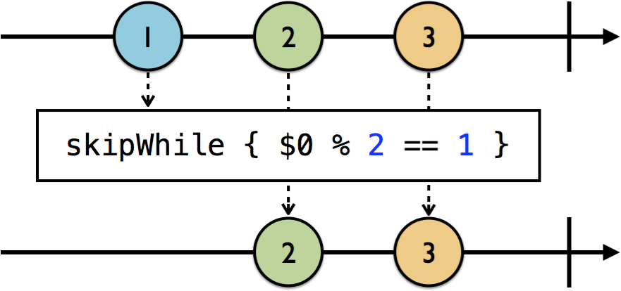

# Section II: Operators and Best Practices

- Operator là những building block của Rx, được sử dụng để chuyển đổi, xử lý và phản hồi lại các event được phát ra bởi các observanles.
- Tương tự như việc kết hợp +-*/ để tạo ra một phép toán phức tạp, ta có thể kết nối (chain) và biên soạn các operator đơn giản của Rx thành một logic app phức tạp.
- Filtering operators: Cho phép xử lý một số event nhưng bỏ qua một số khác.
- Transforming operators: Tạo ra và xử lý các tác vụ phức tạp liên quan đến chuyển đổi data.
- Time based operators: Hoãn event, nhóm event theo từng thời điểm.
- Kết hợp các operators với nhau.

**Nội dung:**
- [Section II: Operators and Best Practices](#Section-II-Operators-and-Best-Practices)
  - [Chapter 5: Filtering Operators](#Chapter-5-Filtering-Operators)
    - [Ignoring operators](#Ignoring-operators)
      - [ignoreElements()](#ignoreElements)
      - [elementAt(n)](#elementAtn)
      - [filter{condition}](#filtercondition)
    - [Skipping operators](#Skipping-operators)
      - [skip(n)](#skipn)
      - [skipWhile{condition}](#skipWhilecondition)
      - [skipUntill(observable)](#skipUntillobservable)
    - [Taking operators](#Taking-operators)
      - [take(n)](#taken)
      - [takeWhile{condition}](#takeWhilecondition)
      - [takeUntil(observable)](#takeUntilobservable)
    - [Distinct operators](#Distinct-operators)
      - [distinctUntilChanged()](#distinctUntilChanged)
    - [Challenges](#Challenges)
  - [Chapter 6: Filtering Operators in Practice](#Chapter-6-Filtering-Operators-in-Practice)
  - [More](#More)
  - [Reference](#Reference)

## Chapter 5: Filtering Operators

Sử dụng filtering operators để giới hạn `.next` event, để các subscriber chỉ nhận những elements cần thiết đối với chúng.

### Ignoring operators

#### ignoreElements()

- Bỏ qua các `.next` event.
- Cho các stop event qua như: `.completed` hoặc `.error`.

<center>
    
</center>

- Ví dụ:

```swift
let strikes = PublishSubject<String>()
let disposeBag = DisposeBag()

strikes
    .ignoreElements()
    .subscribe { _ in
      print("You're out!")
    }
    .disposed(by: disposeBag)

strikes.onNext("X")
strikes.onNext("X")
strikes.onNext("X")
strikes.onCompleted()
```

- Kết qủa:

```
You're out! // In ra khi .onCompleted() được gọi
```

#### elementAt(n)

- Sử dụng khi bạn chỉ muốn xử lý tác vụ tại element thứ n được phát

<center>
    
</center>

#### filter{condition}

- Sử dụng một closure để quyết định, áp dụng cho tất cả các element, chỉ cho phép các element được quyết định true đi qua.

<center>
    
</center>

### Skipping operators

#### skip(n)

- Bỏ qua n element đầu.

<center>
    
</center>

#### skipWhile{condition}

- Sử dụng một closure để quyết định, cho đến khi nào điều kiện quyết định bằng false thì sẽ cho tất cả các element sau đi qua, những element trở về trước đều được bỏ qua.

<center>
    
</center>

#### skipUntill(observable)

- Filter được nhắc tới trong phần trên được dựa trên một điều kiện cố định. Nếu như ta cần phải filter dựa trên observabke khác thì ở đây có một số operator có thể xử lý được điều đó.
- `skipUntil` sẽ bỏ qua các element từ source observable cho đến khi một trong số những trigger observable phát ra.

<center>
    
</center>

- Ví dụ: 

```swift
let disposeBag = DisposeBag()
let subject = PublishSubject<String>()
let trigger = PublishSubject<String>()

subject
    .skipUntil(trigger)
    .subscribe(onNext: { print($0) })
    .disposed(by: disposeBag)

subject.onNext("A")
subject.onNext("B")
trigger.onNext("X")
subject.onNext("C")
```

- Kết quả:

```
C
```

### Taking operators

- Trái ngược với skip.

#### take(n)

- Lấy n element.

<center>
    
</center>

#### takeWhile{condition}

<center>
    
</center>

- Khi ta cần trỏ tới vị trí thứ tự của element được phát ra, sử dụng `enumerated` operator trong Swift Standard Library. Nó sẽ trả về một tuple gồm index và element của mỗi element đã được phát ra.

```swift
let disposeBag = DisposeBag()

Observable.of(2, 2, 4, 4, 6, 6)
    .enumerated()
    .takeWhile { index, integer in
      integer % 2 == 0 && index < 3
    }
    .map { $0.element }
    .subscribe(onNext: { print($0) })
    .disposed(by: disposeBag)
```

```
2
2
4
```

#### takeUntil(observable)

- Tương tự `skipUntil`, `takeUntil` sẽ lấy các element từ source observable cho đến khi một trong số những trigger observable phát ra.

<center>
    
</center>

- Ví dụ:

```
let disposeBag = DisposeBag()

let subject = PublishSubject<String>()
let trigger = PublishSubject<String>()

subject
    .takeUntil(trigger)
    .subscribe(onNext: { print($0) })
    .disposed(by: disposeBag)

subject.onNext("1")
subject.onNext("2")
trigger.onNext("X")
subject.onNext("3")
}
```

- Kết quả:

```
1
2
```

- `takeUntil` có thể được sử dụng để dispose một subscription thay vì add vào dispose bag. Ví dụ:

```
someObservable
    .takeUntil(self.rx.deallocated)
    .subscribe(onNext: { print($0) })
```

### Distinct operators

- Các operators này giúp giảm tải các item giống nhau được đi qua.

#### distinctUntilChanged()

- Bỏ qua các item trùng nhau liên tiếp.
- Sử dụng `distinctUntilChanged` sử dụng `Equatable`:

<center>
    
</center>

```swift
let disposeBag = DisposeBag()

Observable.of("A", "A", "B", "B", "A")
  .distinctUntilChanged()
  .subscribe(onNext: { print($0) })
  .disposed(by: disposeBag)
```

- Hoặc custom `distinctUntilChanged`:

```swift
let disposeBag = DisposeBag()
let formatter = NumberFormatter()
formatter.numberStyle = .spellOut
let space = " "

Observable<NSNumber>.of(10, 110, 20, 200, 210, 310)
    .distinctUntilChanged { a, b in
        guard let aWords = formatter.string(from: a)?.components(separatedBy: space),
        let bWords = formatter.string(from: b)?.components(separatedBy: space) else {
            return false
        }
        var containsMatch = false
        for aWord in aWords {
            for bWord in bWords {
                if aWord == bWord {
                    containsMatch = true
                    break
                }
            }
        }
        return containsMatch
    }.subscribe(onNext: { print($0) })
    .disposed(by: disposeBag)
}
```

### Challenges

```swift
    input
        .asObservable()
        .skipWhile { number -> Bool in
            return number == 0
        }.filter { number -> Bool in
            return number >= 0 && number < 10
        }.take(10)
        .toArray()
        .subscribe(onNext: {
            let phone = phoneNumber(from: $0)
            if let contact = contacts[phone] {
                print("Dialing \(contact) (\(phone))...")
            } else {
                print("Contact not found")
            }
        }).disposed(by: disposeBag)
```

## Chapter 6: Filtering Operators in Practice

<center>
    
</center>

## More

Quay lại chapter trước [Chapter 4: Observables and Subjects in practice][Chapter 4]

Đi đến chapter sau [Chapter 7-8: Transforming Operators][Chapter 78]

Quay lại [RxSwiftDiary's Menu][Diary]

## Reference

[RxSwift: Reactive Programming with Swift][Reference] 

---
[Chapter 4]: ./Section1-Chapter4.md "Observables and Subjects in practice"
[Chapter 78]: ./Section2-Chapter7-8.md "Transforming Operators"
[Diary]: https://github.com/nmint8m/rxswiftdiary "RxSwift Diary"
[Reference]: https://store.raywenderlich.com/products/rxswift "RxSwift: Reactive Programming with Swift"