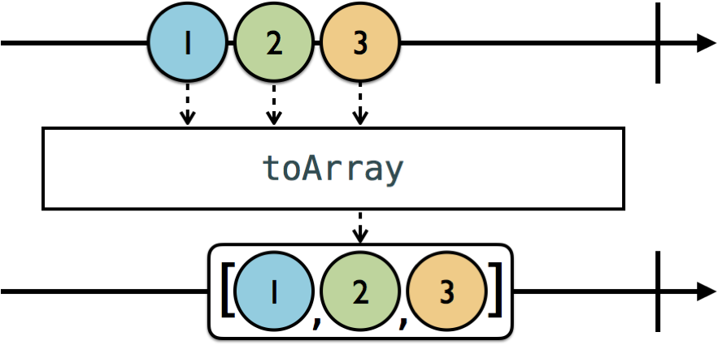

#  Section II: Operators and Best Practices

- Trong chapter này, chúng ta sẽ học về một trong những loại operator quan trọng nhất trong RxSwift: Transforming operators.
- Sử dụng trong vô số trường hợp:
  - Xử lý data từ một observable để cho subscriber sử dụng.
- Thêm một điều nữa là có sự tương đồng giữa các transforming operator của RxSwift và Swift standard library, ví dụ như: `map(_:)` và `flatMap(_:)`

**Nội dung:**

  - [Chapter 7: Transforming Operators](#Chapter-7-Transforming-Operators)
    - [Transforming elements](#Transforming-elements)
    - [Transforming inner observables](#Transforming-inner-observables)
    - [Observing events](#Observing-events)
    - [Challenge](#Challenge)
      - [Challenge 1](#Challenge-1)
  - [Chapter 8: Transforming Operators in Practice](#Chapter-8-Transforming-Operators-in-Practice)
    - [Getting started with GitFeed](#Getting-started-with-GitFeed)
    - [Fetching data from the web](#Fetching-data-from-the-web)
      - [Using map to build a request](#Using-map-to-build-a-request)
      - [Using flatMap to wait for a web response](#Using-flatMap-to-wait-for-a-web-response)
      - [share vs. shareReplay](#share-vs-shareReplay)
    - [Transforming the response](#Transforming-the-response)
      - [Processing the response](#Processing-the-response)
    - [Intermission: Handling erroneous input](#Intermission-Handling-erroneous-input)
    - [Persisting objects to disk](#Persisting-objects-to-disk)
    - [Add a Last-Modified header to the request](#Add-a-Last-Modified-header-to-the-request)
    - [Challenge](#Challenge-1)
      - [Challenge 1](#Challenge-1-1)

<br>

##  Chapter 7: Transforming Operators

Bắt đầu với project `RxSwiftPlayground` trong thư mục `./Document/ExampleProject/07-transforming-operators/Chapter7/`.

### Transforming elements

#### `toArray`

- Observable phát từng phần tử một, tuy nhiên bạn vẫn sẽ cần làm việc với một collection, ví dụ như cần để binding một observable vào một table / collection view.
- Sử dụng `toArray` chuyển từ observable sequence với các element riêng lẻ thành một observable sequence cũng với những element đó nhưng phát ra `.next` event chứa một array tới các  subscribers.

<center>
    
</center>

```swift
example(of: "toArray") {
    let disposeBag = DisposeBag()
    Observable.of(1, 2, 3)
        .toArray()
        .subscribe(onNext: {
            print($0) })
        .disposed(by: disposeBag)
}
```

```
--- Example of: toArray ---
[1, 2, 3]
```

#### `map`

- `map` operator tương tự như hàm `map` trong Swift standard library, khác ở chỗ là nó giành cho observable.

<center>
    
</center>

```swift
example(of: "map") {
    let disposeBag = DisposeBag()
    let formatter = NumberFormatter()
    formatter.numberStyle = .spellOut
    Observable<NSNumber>.of(1, 21, 321)
        .map {
            formatter.string(from: $0) ?? ""
        }
        .subscribe(onNext: {
            print($0)
        })
        .disposed(by: disposeBag)
}
```

```
--- Example of: map ---
one
twenty-one
three hundred twenty-one
```

#### `enumerated` and `map`

- Trong Chapter 5, ta đã biết sử dụng `enumerated` và `map` kết hợp với các filtering operator.

```swift
example(of: "enumerated and map") {
    let disposeBag = DisposeBag()
    Observable.of(1, 2, 3, 4, 5, 6)
        .enumerated()
        .map { index, integer in
            (index + 1) * integer
        }
        .subscribe(onNext: {
            print($0)
        })
        .disposed(by: disposeBag)
}
```

```
--- Example of: enumerated and map ---
1
4
9
16
25
36
```

### Transforming inner observables

- RxSwift có sẵn một số operator trong `flatMap` family, cho phép ta truy cập vào bên trong một observable và làm việc với các observable properties của nó.
- Theo dõi các ví dụ trong phần sau. Đầu tiên add đoạn code này vào `RxSwiftPlayground.swift`:

```swift
struct Student {
  var score: BehaviorSubject<Int>
}
```

#### `flatMap`

- Tài liệu về `flatMap` mô tả thế này: `Projects each element of an observable sequence to an observable sequence and merges the resulting observable sequences into one observable sequence.`

<center>
    
</center>

- Đầu tiên ta có lần lượt các giá trị khởi đầu của elenment O1, O2, O3 là 1, 2 và 3.
- Bắt đầu với O1, `flatMap` nhận object và truy cập vào các giá trị bên trong object và nhân lên 10. Sau đó nó xử lý element vừa được chuyển đổi thành một observable mới (line đầu tiên, phía bên dưới flatMap), observable đó được flattened vào target observable, nơi mà sẽ chuyển các element mới tới các subscriber.
- Sau đó, giá trị của property O1 thay đổi thành 4, trên mable diagram chưa thể hiện điều này, nhưng bằng chứng cho sự thay đổi đó là nó được xử lý đưa vào observable có sẵn cho O1 trước đó với giá trị 40, sau đó được flattened vào target observable.
- Tương tự với O2 và O3.

```swift
struct Student {
    var score: BehaviorSubject<Int>
}

example(of: "flatMap") {
    let disposeBag = DisposeBag()
    let ryan = Student(score: BehaviorSubject(value: 80))
    let charlotte = Student(score: BehaviorSubject(value: 90))
    let student = PublishSubject<Student>()
    student
        .flatMap {
            $0.score
        }
        .subscribe(onNext: {
            print($0)
        })
        .disposed(by: disposeBag)

    student.onNext(ryan)
    student.onNext(charlotte)
    ryan.score.onNext(95)
    charlotte.score.onNext(100)
}
```

```
--- Example of: flatMap ---
80
90
95
100
```
 
- Tóm lại, `flatMap` sẽ tiếp tục xử lý thay đổi từ mỗi observable mà nó tạo ra. 
- Có lúc ta sẽ cần chức năng này và có lúc ta chỉ cần cập nhật element mới nhất trong source observable. Sử dụng `flatMapLatest`.

#### `flatMapLatest`

- `flatMapLatest` là sự kết hợp giữa `map` và `switchLatest`.
- `switchLatest` sẽ được nhắc đến trọng [Chapter 9: Combining Operators][Chapter 910], nó sẽ phát những value từ những observable gần nhất và unsubscribe những observable trước đó.
- Vậy nên `flatMapLatest` `Projects each element of an observable sequence into a new sequence of observable sequences and then transforms an observable sequence of observable sequences into an observable sequence producing values only from the most recent observable sequence.`

<center>
    
</center>

- `flatMapLatest` hoạt động giống với `flatMap`. Điểm khác biệt là nó tự động switch tới observable gần nhất và unsubscribe những cái trước đó.
- Nhìn vào diagram, O1 được nhận bởi `flatMapLatest`, nó thay đổi value thành 10, chuyển nó vào observable mới cho phần tử O1, và flatten nó vào target observable. 
- Sau đó nó `flatMapLatest` nhận 02, nó cũng thực hiện tương tự, switch đến observable của O2 vì giờ nó là observable mới nhất.
- Khi giá trị của O1 thay đổi, `flatMapLatest` vẫn sẽ thực hiện việc chuyển đổi, tuy nhiên sau đó nó sẽ bỏ qua kết quả thực hiện. Quá trình này được lặp lại khi O3 được nhận bởi `flatMapLatest`, nó sẽ switch đến sequence observable của O3 và bỏ qua O2. Kết quả nhận được là ở target observable chỉ nhận được những element mới nhất từ observable mới nhất.

```swift
example(of: "flatMapLatest") {
    let disposeBag = DisposeBag()
    let ryan = Student(score: BehaviorSubject(value: 80))
    let charlotte = Student(score: BehaviorSubject(value: 90))
    let student = PublishSubject<Student>()
    student
        .flatMapLatest {
            $0.score
        }
        .subscribe(onNext: {
            print($0)
        })
        .disposed(by: disposeBag)

    student.onNext(ryan)
    student.onNext(charlotte)
    ryan.score.onNext(95)
    charlotte.score.onNext(100)
}
```

```
--- Example of: flatMapLatest ---
80
90
100
```

### Observing events

#### `materialize()`

- Có lúc ta cần convert một observable thành một observable của những event của chính nó.
- Một trường hợp phổ biến là khi ta không điều khiển được observerble mà có observable propety, và ta muốn handle error event, tránh việc terminate những sequence bên ngoài khác.
- Thêm vào playground đoạn code sau:

```swift
example(of: "materialize and dematerialize") {
    enum MyError: Error {
        case anError
    }

    let disposeBag = DisposeBag()
    let ryan = Student(score: BehaviorSubject(value: 80))
    let charlotte = Student(score: BehaviorSubject(value: 100))
    let student = BehaviorSubject(value: ryan)

    let studentScore = student
        .flatMapLatest {
            $0.score
    }

    studentScore
        .subscribe(onNext: {
            print($0) 
        })
        .disposed(by: disposeBag)

    ryan.score.onNext(85)
    ryan.score.onError(MyError.anError)
    ryan.score.onNext(90)

    student.onNext(charlotte)
}
```

```
--- Example of: materialize and dematerialize ---
80
85
Unhandled error happened: anError
 subscription called from:
```

- Error trên chưa được handle, vì thế nên `studentScore` observable bị terminate và cả những observable bên ngoài `student`.
- Sử dụng `materialize` operator để bọc mỗi event được phát ra bởi một observable bên trong một observable.

<center>
    
</center>

- Đổi `studentScore` thành:

```swift
    let studentScore = student
        .flatMapLatest {
            $0.score.materialize()
    }
```

```
--- Example of: materialize and dematerialize ---
next(80)
next(85)
error(anError)
next(100)
```

- Option-click vào `studentScore` sẽ thấy nó có kiểu `Observable<Event<Int>>` thay vì `Observable<Int>`. 
- Error vẫn sẽ làm cho `studentScore` terminate, tuy nhiên các observable bên ngoài student sẽ không bị, vậy nên khi switch đến student mới, điểm số của student đó sẽ được in ra thành công.

#### `dematerialize()`

- Vấn đề là giờ ta đang làm việc với event, không phải element như lúc trước. Và bây giờ là lúc chúng ta cần `dematerialize`. Nó giúp convert từ materialized observable về kiểu ban đầu của nó.

<center>
    
</center>

- Đổi subscription thành:

```swift
    studentScore
        .filter {
            guard let error = $0.error else {
                return true
            }
            print(error)
            return false
        }
        .dematerialize()
        .subscribe(onNext: {
            print($0)
        })
        .disposed(by: disposeBag)
```

```
--- Example of: materialize and dematerialize ---
80
85
anError
100
```

### Challenge

#### Challenge 1

- Modify the challenge from Chapter 5 to take alpha-numeric characters
- Bắt đầu với project `RxSwiftPlayground` trong thư mục `./Document/ExampleProject/07-transforming-operators/challenge/`

```swift
input.asObservable()
        .map { convert($0) }
        .filter { $0 != nil }
        .unwrap()
        .skipWhile { $0 == 0 }
        .take(10)
        .toArray()
        .subscribe(onNext: {
            let phone = format($0)
            print(dial(phone))
        })
        .disposed(by: disposeBag)
```

```
Dialing Florent (603-555-1212)...
```

<br>
<br>

##  Chapter 8: Transforming Operators in Practice
### Getting started with GitFeed
### Fetching data from the web
#### Using map to build a request 
#### Using flatMap to wait for a web response
#### share vs. shareReplay
### Transforming the response
#### Processing the response
### Intermission: Handling erroneous input
### Persisting objects to disk
### Add a Last-Modified header to the request
### Challenge
#### Challenge 1

- Fetch top repos and spice up the feed

<center>
    
</center>

## More

Quay lại chapter trước [Chapter 5-6: Filtering operators and Filtering operators in practice][Chapter 56]

Đi đến chapter sau [Chapter 9-10: Combining operators and Combining operators in practice][Chapter 910]

Quay lại [RxSwiftDiary's Menu][Diary]

## Reference

[RxSwift: Reactive Programming with Swift][Reference] 

---
[Chapter 56]: ./Section1-Chapter5-6.md "Filtering operators"
[Chapter 910]: ./Section2-Chapter9-10.md "Combining operators"
[Diary]: https://github.com/nmint8m/rxswiftdiary "RxSwift Diary"
[Reference]: https://store.raywenderlich.com/products/rxswift "RxSwift: Reactive Programming with Swift"